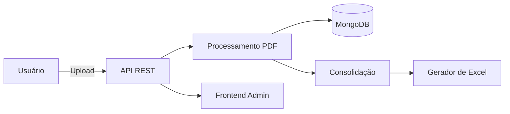

# ARCHITECTURE.md — Arquitetura do Sistema de Extração e Consolidação de Contracheques

## 📌 Visão Geral da Arquitetura
O sistema é composto por um backend moderno em **Spring Boot 3.x (Java 21 + Kotlin)**, integrado ao banco **MongoDB** e preparado para executar parsing avançado de PDFs da Caixa e da Funcef, consolidar valores e expor APIs REST para um painel administrativo.

A arquitetura segue princípios de:
- **Clean Architecture**
- **Domain-Driven Design**
- **Reatividade (Spring WebFlux + MongoDB Reactive)**
- **Escalabilidade Horizontal**
- **Processamento Assíncrono**
- **Separação de responsabilidades por camadas**

---

# 🏗️ CAMADAS DA ARQUITETURA

## 1️⃣ **Camada de Entrada (Interface / Web Layer)**
Responsável pela comunicação com o mundo externo.

### Componentes:
- **Controllers REST (WebFlux)**  
  - DocumentUploadController  
  - DocumentProcessController  
  - PersonController  
  - RubricaController  
  - ConsolidationController  

### Funções:
- Receber uploads multipart
- Receber requisições REST
- Validar input
- Delegar ao service correto
- Produzir respostas reativas (`Mono`, `Flux`)

---

## 2️⃣ **Camada de Aplicação (Application Layer)**  
Aqui ficam os serviços orquestradores.

### Componentes:
- **DocumentService**
- **ProcessamentoService**
- **PersonService**
- **RubricaService**
- **ConsolidationService**

### Funções:
- Controlar fluxo de processamento
- Gerenciar transições de status de documentos
- Orquestrar extração de PDFs
- Criar e agrupar as entradas (PayrollEntry)
- Construir agregações e consolidações
- Interagir com repositórios reativos

---

## 3️⃣ **Camada de Domínio (Domain Layer)**  
Aqui ficam as regras de negócio, modelos e interfaces.

### Entidades:
- `Person`
- `PayrollDocument`
- `PayrollEntry`
- `Rubrica`

### Objetos de valor:
- `PdfMetadata`
- `DocumentType`
- `MonthYear`

### Interfaces:
- `MetadataExtractor`
- `RubricaParser`
- `PdfPageIterator`

### Regras de negócio principais:
- Identificação automática de CAIXA, FUNCEF ou MISTO
- Normalização de datas
- Normalização de valores monetários
- Validação de rubricas parametrizadas
- Consolidação de documentos por ano/mês

---

## 4️⃣ **Camada de Infraestrutura (Infrastructure Layer)**

### Componentes:
- Repositórios MongoDB (reativos)
- GridFS (opcional) para PDFs grandes
- PDF parsing (Tika + PDFBox)
- Excel export (Apache POI)
- Logging estruturado
- Configuração global (CORS, OpenAPI, Actuator)

### Estrutura de Collections:
```
persons
payroll_documents
payroll_entries
rubricas
```

### Repositórios:
- PersonRepository
- PayrollDocumentRepository
- PayrollEntryRepository
- RubricaRepository

---

# 🧩 FLUXO COMPLETO DO PROCESSAMENTO

## 1. Upload do PDF
```
POST /api/v1/documents/upload
```
Fluxo:
1. Usuário faz upload
2. Salva documento no Mongo (com status: `PENDING`)
3. Responde ao cliente o ID

---

## 2. Disparo do processamento
```
POST /api/v1/documents/{id}/process
```

Fluxo interno:
1. Atualiza status → `PROCESSING`
2. Carrega PDF
3. Detecta tipo (CAIXA / FUNCEF / MISTO)
4. Extrai metadados
5. Percorre páginas
6. Extrai rubricas linha-a-linha
7. Normaliza e salva entradas
8. Atualiza status → `PROCESSED`

---

## 3. Extração de Metadados (Caixa e Funcef)

### CAIXA → padrões detectados:
- Nome do empregado
- CPF
- Mês/Ano de Pagamento
- Agência / Conta
- Matrícula
- Cargo

### FUNCEF → padrões detectados:
- Nome do beneficiário
- CPF
- Ano Pagamento / Mês
- Valor líquido do benefício
- Plano (Novo Plano / Saldado)

---

## 4. Extração de Rubricas
Utiliza expressões regulares diferentes para cada instituição.

### Exemplo CAIXA:
```
(\d{4})\s+(.*?)\s+(\d{4}\/\d{2})\s+R\$\s+([\d.,]+)
```

### Exemplo FUNCEF:
```
(\d{4})\s+(.*?)\s+R\$\s+([\d.,]+)
```

### Normalização:
- "1.298,99" → `1298.99`
- Mês/Ano → `YYYY-MM`

---

# 📚 MODELO DE DADOS

## Person
```json
{
  "cpf": "12449709568",
  "nome": "FLAVIO JOSÉ PEREIRA ALMEIDA",
  "documentos": ["id1", "id2", "id3"]
}
```

## PayrollDocument
```json
{
  "id": "doc123",
  "pessoaId": "cpf123",
  "tipo": "CAIXA",
  "ano": 2018,
  "status": "PROCESSED",
  "numeroPaginas": 4
}
```

## PayrollEntry
```json
{
  "documentoId": "doc123",
  "codigo": 3430,
  "descricao": "CONTRIBUIÇÃO EXTRAORDINÁRIA 2014",
  "mes": 1,
  "ano": 2018,
  "valor": 424.10,
  "origem": "FUNCEF"
}
```

---

# 📦 ARQUITETURA DE PASTAS DO BACKEND

```
src/main/kotlin/com/projeto
 ├── application
 │   ├── services
 │   ├── dto
 ├── domain
 │   ├── model
 │   ├── enums
 │   ├── interfaces
 ├── infrastructure
 │   ├── repositories
 │   ├── pdf
 │   ├── config
 │   ├── excel
 ├── web
 │   ├── controllers
 │   ├── handlers
```

---

# 🚀 INTEGRAÇÕES FUTURAS

### 1. Painel administrativo (React)
- Uploads
- Visualização dos documentos
- Listagem das rubricas extraídas
- Geração dinâmica de Excel

### 2. Autenticação para administradores
- JWT ou Keycloak

---

# 📐 DECISÕES DE ARQUITETURA

### ✔ MongoDB em vez de SQL
- Estrutura flexível (dados variáveis por documento)
- Ideal para documentos JSON
- Extração de PDF gera dados não tabulares

### ✔ Spring WebFlux
- Processamento reativo para PDFs grandes
- Melhor uso de recursos em I/O bound

### ✔ PDFBox + Tika
- Melhor acurácia para documentos multi-instituição

### ✔ Clean Architecture
- Permite expansão futura (ex.: IA para extração de texto)
- Testabilidade elevada

---

# 📝 DIAGRAMA DE ALTO NÍVEL



---

# 🧭 CONCLUSÃO

Este documento define a arquitetura base de um sistema escalável, robusto e altamente modular para extração, análise e consolidação de contracheques CAIXA + FUNCEF.

Caso queira, posso gerar:
- Diagrama completo de sequência  
- Diagrama de estados do documento  
- Diagrama de contexto  
- Versão em PlantUML  
