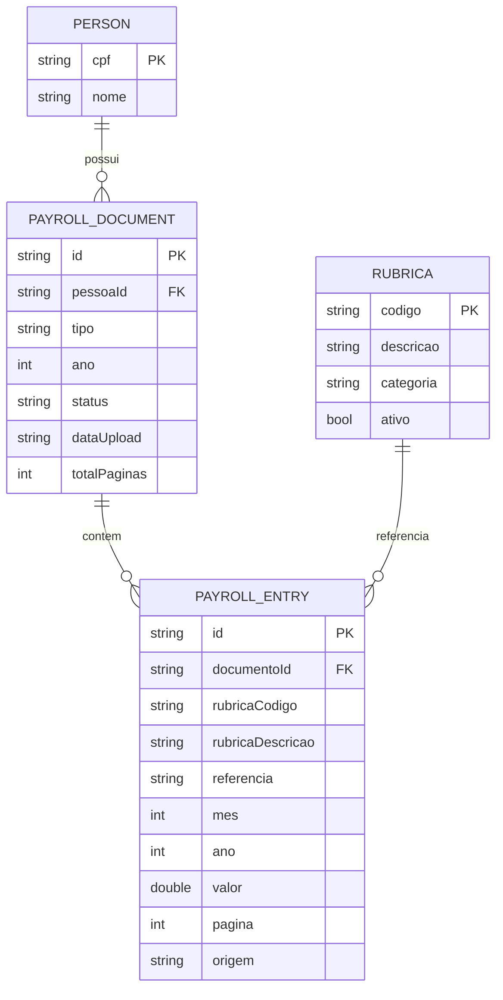

# Entity-Relationship Diagram (MongoDB)

```mermaid
erDiagram
    PERSON {
        string cpf PK
        string nome
    }
    PAYROLL_DOCUMENT {
        string id PK
        string pessoaId FK
        string tipo
        int ano
        string status
        string dataUpload
        int totalPaginas
    }
    PAYROLL_ENTRY {
        string id PK
        string documentoId FK
        string rubricaCodigo
        string rubricaDescricao
        string referencia
        int mes
        int ano
        double valor
        int pagina
        string origem
    }
    RUBRICA {
        string codigo PK
        string descricao
        string categoria
        bool ativo
    }

    PERSON ||--o{ PAYROLL_DOCUMENT : possui
    PAYROLL_DOCUMENT ||--o{ PAYROLL_ENTRY : contem
    RUBRICA ||--o{ PAYROLL_ENTRY : referencia
```
