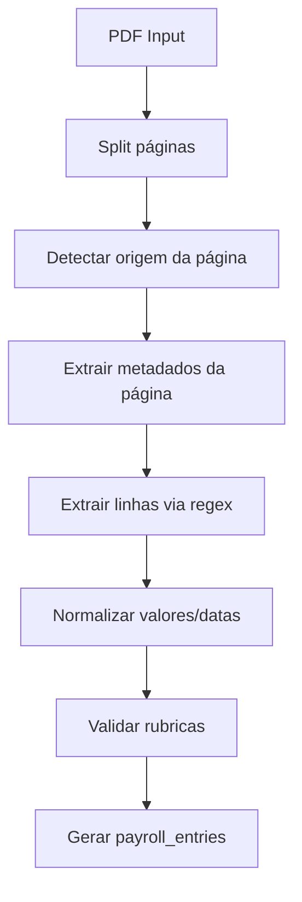
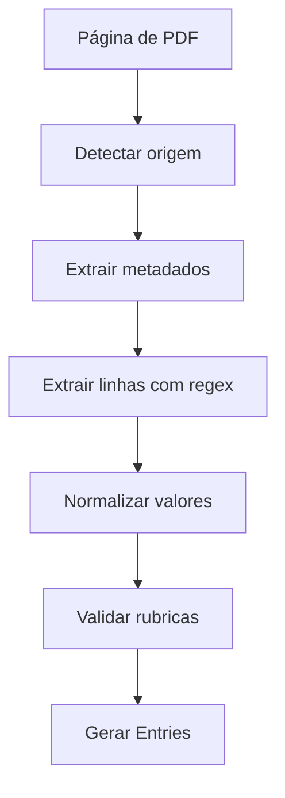

# EXTRATOR.md
# 🎯 Manual Oficial do Extrator de Contracheques (CAIXA + FUNCEF)

Este documento descreve **todo o comportamento do extrator**, incluindo:

- Regex completas  
- Heurísticas de detecção  
- Normalização (datas, valores, descrições)  
- Pipeline completo (página → linhas → entries)  
- Regras especiais de CAIXA e FUNCEF  
- Casos limites e comportamento esperado  

É a documentação **definitiva** para implementação do módulo de parsing.

---

# 1. OBJETIVO DO EXTRATOR

O extrator tem como função:

1. Ler o PDF (todas páginas)  
2. Determinar origem de cada página (CAIXA, FUNCEF, MISTO)  
3. Extrair metadados gerais  
4. Extrair rubricas linha por linha  
5. Normalizar todos os dados  
6. Gerar `payroll_entries` prontos para inserção no MongoDB  

---

# 2. PIPELINE COMPLETO DO EXTRATOR



---

# 3. DETECÇÃO DO TIPO DE DOCUMENTO

## 3.1 Regras para Caixa

Detectar se contém *qualquer* dos termos:

- `"CONTRACHEQUE"`
- `"CAIXA ECONÔMICA"`
- `"CAIXA ECONÔMICA FEDERAL"`
- `"MÊS DE REFERÊNCIA"`
- `"MÊS/ANO"`

### Regex (case-insensitive)

```
(?i)(contracheque|caixa econômica|mês de referência)
```

---

## 3.2 Regras para Funcef

Detectar se contém:

- `"DEMONSTRATIVO DE PROVENTOS"`
- `"PREVIDENCIÁRIOS"`
- `"FUNCEF"`
- `"VALOR LÍQUIDO"`

### Regex

```
(?i)(previdenciários|funcef|demonstrativo de proventos)
```

---

## 3.3 Determinação Final do Tipo

| Caso encontrado | Tipo |
|-----------------|------|
| Apenas Caixa | CAIXA |
| Apenas Funcef | FUNCEF |
| Ambos | MISTO (páginas separadas) |

---

# 4. EXTRAÇÃO DE METADADOS

## 4.1 Caixa – Campos obrigatórios

| Campo | Padrão | Exemplo |
|-------|--------|---------|
| Nome | Linha superior | `FLAVIO JOSE PEREIRA ALMEIDA` |
| CPF | regex | `124.497.095-68` |
| Referência | `MM/YYYY` | `01/2017` |

### Regex CPF Caixa

```
([0-9]{3}\.[0-9]{3}\.[0-9]{3}-[0-9]{2})
```

### Regex Referência

```
([0-9]{2}\/[0-9]{4})
```

---

## 4.2 Funcef – Campos obrigatórios

| Campo | Padrão | Exemplo |
|-------|--------|---------|
| Nome | Linha superior | `FLAVIO JOSE PEREIRA ALMEIDA` |
| CPF | sem máscara | `12449709568` |
| Referência | inverter no final | `2018/01` |

### Regex CPF Funcef

```
([0-9]{11})
```

---

# 5. EXTRAÇÃO DE RUBRICAS

# 5.1 Regex CAIXA — COMPLETA

```
^([0-9]{3,4})\s+(.+?)\s+([0-9]{2}\/[0-9]{4}|[0-9]{4}\/[0-9]{2})\s+R\$?\s*([0-9\.,]+)
```

### Capturas

| Grupo | Valor | Significado |
|-------|--------|--------------|
| 1 | 4482 | Código |
| 2 | CONTRIBUIÇÃO EXTRAORDINÁRIA 2015 | Descrição |
| 3 | 2017/08 | Referência |
| 4 | 885,47 | Valor |

---

# 5.2 Regex FUNCEF — COMPLETA

Funcef varia mais. Possíveis linhas:

```
4236 FUNCEF NOVO PLANO           R$ 1.385,66
4482 CONTRIB... EXTRAORD...      R$ 424,10
```

### Regex consolidada

```
^([0-9]{3,4})\s+(.+?)\s+(R\$)?\s*([0-9\.,]+)
```

### Diferença crítica
Funcef não fornece a referência na mesma linha:

- a referência vem do cabeçalho
- replicar referência para todas as linhas da página

---

# 6. NORMALIZAÇÃO

## 6.1 Números

### Regras

```
1.399,59 → 1399.59
885,47 → 885.47
```

### Algoritmo

1. remover pontos  
2. trocar vírgula por ponto  
3. converter double  

### Regex para capturar valores

```
([0-9\.]+,[0-9]{2})
```

---

# 6.2 Datas

Aceitar:

```
MM/YYYY
YYYY/MM
```

### Normalização

```
01/2017 → 2017-01
2017/01 → 2017-01
```

---

# 6.3 Descrição

Remover:

- múltiplos espaços
- caracteres estranhos
- sufixos desnecessários

Exemplo:

```
"CONTRIBUIÇÃO EXTRAORDINÁRIA 2015 " → "CONTRIBUIÇÃO EXTRAORDINÁRIA 2015"
```

---

# 7. VALIDAÇÃO DE RUBRICAS

Ao capturar uma rubrica:

1. Ler código do PDF
2. Buscar no Mongo:

```
rubricas.findOne({ codigo, ativo: true })
```

3. Se não existir:

- marcar `ignoredRubrica`
- logar comportamento
- **não persistir entry**

---

# 8. GERANDO PAYROLL_ENTRIES

Entry final:

```json
{
  "documentId": "doc123",
  "rubricaCodigo": "4482",
  "rubricaDescricao": "CONTRIBUIÇÃO EXTRAORDINÁRIA 2015",
  "referencia": "2017-08",
  "valor": 885.47,
  "pagina": 1,
  "origem": "CAIXA"
}
```

---

# 9. PIPELINE DE EXTRAÇÃO POR PÁGINA



---

# 10. ERROS E CASOS LIMITES

| Caso | Ação |
|------|------|
| Página sem rubricas | Ignorar |
| Código inválido | Log + ignorar |
| Valor sem referência (Caixa) | Log + ignorar |
| Funcef sem referência | Buscar referência do cabeçalho |
| PDF corrompido | Throw → status=ERROR |
| Linha sem valor | Ignorar |

---

# 11. CLASSES DO MÓDULO EXTRATOR

- `DocumentTypeDetector`
- `CaixaMetadataExtractor`
- `FuncefMetadataExtractor`
- `PdfPageSplitter`
- `PdfLineParser`
- `PdfNormalizer`
- `RubricaValidator`
- `EntryBuilder`

---

# 12. ORDEM DE IMPLEMENTAÇÃO

1. Criar detectores
2. Criar extratores de metadados
3. Criar regex completas
4. Criar parser de linhas
5. Criar normalizadores
6. Criar validador de rubricas
7. Criar entry builder
8. Integrar pipeline reativo
9. Testar com PDFs fornecidos

---

Fim do documento EXTRATOR.md.