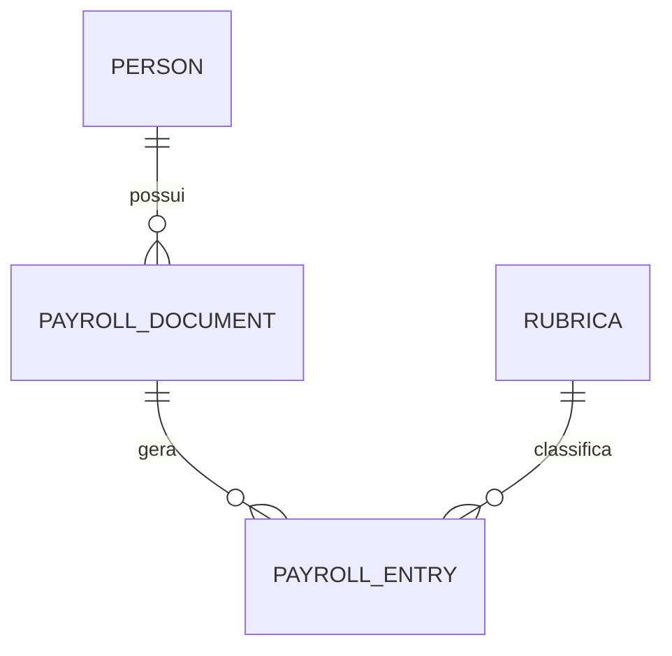

# DATA_DICTIONARY.md — Dicionário de Dados (MongoDB)

Este documento descreve **todas as collections do MongoDB**, seus campos, formatos, tipos e regras de negócio relacionadas ao sistema de extração de contracheques CAIXA + FUNCEF.

---

# 📁 1. COLLECTION: persons

Representa uma pessoa (CPF) que possui um ou mais contracheques processados.

### 📌 Estrutura
```json
{
  "cpf": "string",
  "nome": "string",
  "documentos": ["string"]
}
```

### 🔍 Campos
| Campo | Tipo | Obrigatório | Descrição |
|-------|------|-------------|-----------|
| cpf | string | ✔ | Identificador principal (PK) |
| nome | string | ✔ | Nome completo do titular |
| documentos | array[string] | ❌ | Lista de IDs de documentos associados |

---

# 📁 2. COLLECTION: payroll_documents

Armazena cada PDF enviado, seus metadados, status e origem (CAIXA/FUNCEF/MISTO).

### 📌 Estrutura
```json
{
  "id": "string",
  "pessoaId": "string",
  "tipo": "CAIXA | FUNCEF | MISTO",
  "ano": 2020,
  "mesReferencia": "YYYY-MM",
  "status": "PENDING | PROCESSING | PROCESSED | ERROR",
  "numeroPaginas": 5,
  "dataUpload": "ISODate",
  "resumoRubricas": {
     "3430": 424.10
  }
}
```

### 🔍 Campos
| Campo | Tipo | Obrigatório | Descrição |
|-------|------|-------------|-----------|
| id | string | ✔ | ID Mongo |
| pessoaId | string | ✔ | CPF do titular |
| tipo | string | ✔ | Tipo de documento detectado |
| ano | number | ❌ | Ano identificado no PDF |
| mesReferencia | string | ❌ | Mês/Ano normalizado |
| status | string | ✔ | Controle de processamento |
| numeroPaginas | number | ❌ | Total de páginas |
| dataUpload | ISODate | ✔ | Timestamp do upload |
| resumoRubricas | object | ❌ | Totais por rubrica no documento |

---

# 📁 3. COLLECTION: payroll_entries

Armazena cada linha extraída do contracheque.

### 📌 Estrutura
```json
{
  "id": "string",
  "documentoId": "string",
  "codigo": 3430,
  "descricao": "CONTRIBUIÇÃO EXTRAORDINÁRIA 2014",
  "mes": 1,
  "ano": 2018,
  "valor": 424.10,
  "origem": "CAIXA | FUNCEF",
  "pagina": 3
}
```

### 🔍 Campos
| Campo | Tipo | Obrigatório | Descrição |
|-------|------|-------------|-----------|
| id | string | ✔ | PK |
| documentoId | string | ✔ | Referência ao payroll_documents |
| codigo | number | ✔ | Código da rubrica |
| descricao | string | ✔ | Descrição extraída |
| mes | number | ✔ | Mês extraído ou normalizado |
| ano | number | ✔ | Ano extraído ou normalizado |
| valor | number | ✔ | Valor numérico |
| origem | string | ✔ | Caixa/FUNCEF |
| pagina | number | ❌ | Página onde foi extraída |

---

# 📁 4. COLLECTION: rubricas

Lista de rubricas válidas e configuráveis pelo administrador.

### 📌 Estrutura
```json
{
  "codigo": 3430,
  "descricao": "CONTRIBUIÇÃO EXTRAORDINÁRIA 2014",
  "categoria": "string",
  "ativo": true
}
```

### 🔍 Campos
| Campo | Tipo | Obrigatório | Descrição |
|-------|------|-------------|-----------|
| codigo | number | ✔ | Código único |
| descricao | string | ✔ | Nome da rubrica |
| categoria | string | ❌ | Categoria de agrupamento |
| ativo | boolean | ✔ | Status da rubrica |

---

# 📁 5. COLLECTION (Opcional): processing_logs

Registra logs do processamento, útil para depuração.

### 📌 Estrutura
```json
{
  "id": "string",
  "documentoId": "string",
  "timestamp": "ISODate",
  "mensagem": "string",
  "tipo": "INFO | ERROR | WARN"
}
```

---

# 🧩 RELACIONAMENTOS



---

# 📝 CONCLUSÃO

Este dicionário representa **toda a estrutura do banco MongoDB**, com campos, tipos e validações, servindo como documentação técnica para backend e frontend.

Se quiser, posso gerar também:

- DATA_MODEL.json (para importação em ferramentas)
- Diagramas em PNG/SVG
- Documento para auditoria
- Versão resumida para o README
