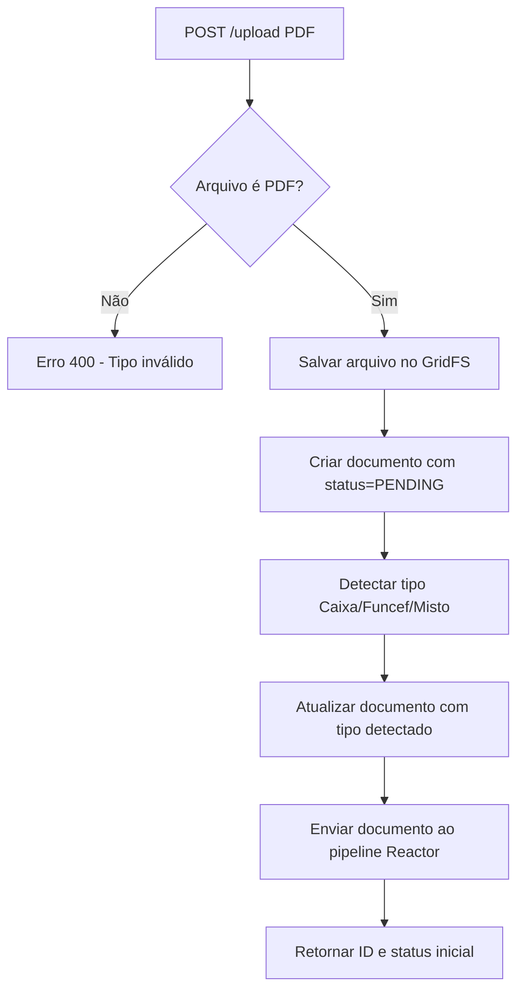

# API_2_UPLOAD.md
## API 2 — Upload de Documentos (Documentação Completa e Extensivamente Detalhada)

--------------------------------------------------------------------------------
# 1. Visão Geral

A API de Upload de Documentos é o ponto inicial do pipeline de processamento do sistema.  
Ela recebe arquivos PDF enviados por um usuário (admin/instrutor), identifica o tipo do documento (CAIXA, FUNCEF, MISTO), armazena o arquivo no MongoDB e inicia o processo de extração via pipeline reativo.

É a primeira API funcional do fluxo de processamento.

--------------------------------------------------------------------------------
# 2. Objetivos da API

1. Permitir o envio de arquivos PDF.
2. Validar tipo, tamanho e integridade do arquivo.
3. Criar documento em `payroll_documents`.
4. Detectar automaticamente o tipo do PDF (Caixa/Funcef/Misto).
5. Registrar status inicial.
6. Integrar com o pipeline reativo do extrator.
7. Garantir associação com o CPF do titular.
8. Evitar duplicidade (mesmo arquivo enviado repetidas vezes).

--------------------------------------------------------------------------------
# 3. Estrutura do Documento (MongoDB)

## 3.1 payroll_documents

```json
{
  "id": "65f123abc",
  "cpf": "12449709568",
  "tipo": "CAIXA | FUNCEF | CAIXA_FUNCEF",
  "anoDetectado": 2017,
  "mesesDetectados": ["2017-01", "2017-02", "2017-03"],
  "status": "PENDING",
  "dataUpload": "2024-01-10T14:33:00Z",
  "detectedPages": [
    { "page": 1, "origem": "CAIXA" },
    { "page": 2, "origem": "FUNCEF" }
  ],
  "originalFileId": "692b785ed8e871782e707a0e",
  "fileHash": "011b9258bb787f458dac27280a3445592857731d177a6bc1b020c2edc4eb4d9b"
}
```

### Campos

| Campo | Tipo | Descrição |
|------|------|-----------|
| id | string | ID do documento no Mongo |
| cpf | string | CPF associado ao documento |
| tipo | enum | CAIXA, FUNCEF ou CAIXA_FUNCEF |
| anoDetectado | int | Ano detectado no PDF (ano mais recente encontrado) |
| mesesDetectados | array | Lista de meses detectados no formato ["2017-01", "2017-02"] |
| status | string | PENDING → PROCESSING → PROCESSED → ERROR |
| detectedPages | array | Origem por página com detecção de tipo e mês/ano |
| originalFileId | string | ID do arquivo original no GridFS |
| fileHash | string | Hash SHA-256 do arquivo para evitar duplicidade |
| dataUpload | Instant | Data/hora do upload |

--------------------------------------------------------------------------------
# 4. Fluxograma Oficial do Upload



--------------------------------------------------------------------------------
# 5. Endpoints Detalhados

## 5.1 Upload de Documento
```
POST /api/v1/documents/upload
```

### Multipart Form Data

| Campo | Tipo | Obrigatório | Descrição |
|-------|-------|------------|-----------|
| file | PDF | ✔ | Arquivo PDF do contracheque |
| cpf | string | ✔ | CPF do titular (validado conforme regras da Receita Federal) |
| nome | string | ✖ | Nome completo do titular (opcional) |

### Request Exemplo

multipart:
- file: `ContraCheque_2017.pdf`
- cpf: `"12449709568"`
- nome: `"João Silva"` (opcional)

### Response Sucesso (201)

```json
{
  "documentId": "65f123abc",
  "status": "PENDING",
  "tipoDetectado": "CAIXA"
}
```

### Possíveis Erros

| Código | Motivo |
|-------|--------|
| 400 | Arquivo ausente |
| 400 | Não é PDF |
| 409 | Arquivo duplicado (mesmo hash já existe) |
| 422 | CPF inválido (não passa na validação da Receita Federal) |
| 500 | Falha ao salvar no GridFS |

--------------------------------------------------------------------------------
# 6. Regras de Negócio

### 6.1 Validação do PDF
- Deve ter extensão `.pdf`
- Deve possuir páginas > 0
- Deve ter texto extraível (Tika/PDFBox valida)

### 6.1.1 Validação de CPF
- CPF é validado conforme as regras da Receita Federal do Brasil
- Algoritmo Mod11 é aplicado para validar os dígitos verificadores
- CPFs com todos os dígitos iguais são rejeitados (ex: 111.111.111-11)
- Upload é bloqueado se o CPF for inválido (erro 422)

### 6.1.2 Prevenção de Duplicidade
- Hash SHA-256 do arquivo é calculado antes do upload
- Sistema verifica se já existe documento com o mesmo hash
- Se duplicado, retorna erro 409 com o ID do documento existente

### 6.2 Associação ao CPF
- Se o CPF ainda não existir na coleção `persons`, deve ser criado automaticamente
- Se o nome for fornecido no upload, será salvo na pessoa
- Se a pessoa já existir sem nome e o nome for fornecido, será atualizada

```json
{
  "cpf": "12449709568",
  "nome": "João Silva",
  "documentos": ["65f123abc"]
}
```

Se o nome não for fornecido, será `null` e poderá ser preenchido pelo extrator posteriormente.

### 6.3 Status Inicial

| Status | Descrição |
|--------|-----------|
| `PENDING` | Documento aguardando processamento |
| `PROCESSING` | Sendo processado |
| `PROCESSED` | Finalizado |
| `ERROR` | Falha no processamento |

### 6.4 Identificação Automática do Tipo

O PDF passa por heurísticas:

#### CAIXA:
- texto contém `"CONTRACHEQUE"`
- contém `"CAIXA ECONÔMICA FEDERAL"`

#### FUNCEF:
- contém `"PREVIDENCIÁRIOS"`
- contém `"FUNCEF"`

#### CAIXA_FUNCEF (anteriormente MISTO):
- contém palavras-chave de ambos  
- ou páginas alternadas com padrões distintos

### 6.5 Criação do Documento

Durante o upload, o sistema:
1. Detecta o tipo do documento (CAIXA, FUNCEF ou CAIXA_FUNCEF)
2. Processa cada página do PDF
3. Detecta mês/ano de pagamento em cada página:
   - **CAIXA**: Formato "Mês/Ano de Pagamento: JANEIRO / 2016" → "2016-01"
   - **FUNCEF**: Formato "Ano Pagamento / Mês: 2018/01" → "2018-01"
4. Identifica a origem de cada página (CAIXA ou FUNCEF)
5. Calcula o hash SHA-256 do arquivo para evitar duplicidade

```json
{
  "cpf": "12449709568",
  "status": "PENDING",
  "tipo": "CAIXA",
  "anoDetectado": 2016,
  "mesesDetectados": ["2016-01", "2016-02", "2016-03"],
  "dataUpload": "2024-01-10T14:33:00Z",
  "originalFileId": "692b785ed8e871782e707a0e",
  "fileHash": "011b9258bb787f458dac27280a3445592857731d177a6bc1b020c2edc4eb4d9b",
  "detectedPages": [
    { "page": 1, "origem": "CAIXA" },
    { "page": 2, "origem": "CAIXA" }
  ]
}
```

--------------------------------------------------------------------------------
# 7. Interação desta API com demais módulos

### Extrator
O documento salvo pelo upload será capturado pelo Worker Reativo:

```
PENDING → PROCESSING → PROCESSED
```

### Consolidado
Somente documentos PROCESSED são considerados.

### Excel
Dados consolidados dependem totalmente da extração iniciada por esta API.

--------------------------------------------------------------------------------
# 8. Exemplo Completo de Execução

1. Admin faz upload do arquivo.
2. API salva no GridFS.
3. Cria documento com status=PENDING.
4. Detector identifica tipo.
5. Atualiza documento.
6. Dispara pipeline reativo.
7. Extrator processa página por página.
8. Rubricas são validadas com a API 1.
9. payroll_entries são gerados.
10. Documento fica PROCESSED.

--------------------------------------------------------------------------------
# 9. Considerações Técnicas de Implementação

- Validar CPF com algoritmo `mod11` conforme regras da Receita Federal.
- Limitar tamanho máximo (default: 10MB).
- Criar índices em:
  - cpf
  - status
  - dataUpload
  - fileHash (único) - para evitar duplicidade
- GridFS deve ser usado para armazenar PDF (collections `fs.files` e `fs.chunks`).
- Detecção automática de meses/anos por página durante o upload.
- Suporte a campo `nome` opcional no upload para preencher dados da pessoa.

--------------------------------------------------------------------------------
# 10. Casos de Erro Exemplo

### Arquivo não é PDF
```json
{
  "status": 400,
  "error": "O arquivo enviado não é um PDF válido."
}
```

### CPF inválido
```json
{
  "status": 422,
  "error": "CPF inválido: 12345678900"
}
```

### Arquivo duplicado
```json
{
  "status": 409,
  "error": "Este arquivo já foi enviado anteriormente. DocumentId: 692b785ed8e871782e707a0e"
}
```

### Falha ao salvar PDF
```json
{
  "status": 500,
  "error": "Falha ao armazenar o arquivo."
}
```

--------------------------------------------------------------------------------
# 11. Conclusão

Esta API prepara todos os documentos que serão processados pelo sistema.  
Sem ela, nenhum extrator é executado e nenhuma entrada é criada.

A próxima API será:

👉 **API_3_PROCESS_DOCUMENT.md**

--------------------------------------------------------------------------------
