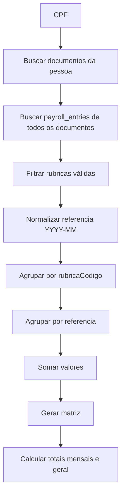

# API_5_CONSOLIDATED.md
# 📘 API 5 — Consolidação por Pessoa (Matriz Ano/Mês por Rubrica)
A consolidação é o **coração do sistema**: transforma todas as rubricas extraídas dos PDFs em uma **tabela matricial organizada por ano/mês**, exatamente no formato esperado pelo Excel final.

Esta API fornece:

- matriz consolidada por CPF
- totais por rubrica
- totais por mês
- detecção de anos disponíveis
- dados preparados para exportação de Excel

---

# 1. OBJETIVO

Gerar uma visão **única, estruturada e totalizada** das rubricas de uma pessoa, cruzando:

- rubricas válidas
- meses e anos extraídos
- origem (CAIXA/FUNCEF)
- valores numéricos normalizados

Exemplo final:

| Código | Rubrica | 2017/01 | 2017/02 | ... | 2017/12 | Total |
|--------|---------|----------|----------|------|-----------|--------|
| 4482 | CONTRIB EXTRA 2015 | 424,10 | 885,47 | 0 | ... | 1309,57 |

---

# 2. ENDPOINT PRINCIPAL

## ▶️ GET /api/v1/persons/{cpf}/consolidated

### 📌 Query params opcionais
| Param | Exemplo | Descrição |
|--------|----------|------------|
| ano | 2017 | consolida apenas 1 ano |
| origem | CAIXA | filtra CAIXA/FUNCEF/MIX |

---

# 3. RESPONSE COMPLETO (EXEMPLO REALISTA)

```json
{
  "cpf": "12449709568",
  "nome": "FLAVIO JOSE PEREIRA ALMEIDA",
  "anos": ["2016", "2017", "2018"],
  "meses": ["01","02","03","04","05","06","07","08","09","10","11","12"],
  "rubricas": [
    {
      "codigo": "4482",
      "descricao": "CONTRIBUIÇÃO EXTRAORDINÁRIA ABONO ANUAL 2015",
      "valores": {
        "2017-01": 424.10,
        "2017-02": 885.47,
        "2017-03": 0,
        ...
      },
      "total": 1309.57
    },
    {
      "codigo": "3430",
      "descricao": "REP CONTRIBUIÇÃO EXTRAORDINÁRIA 2014",
      "valores": {
        "2017-01": 276.21,
        "2017-02": 2477.73
      },
      "total": 2753.94
    }
  ],
  "totaisMensais": {
    "2017-01": 700.31,
    "2017-02": 3363.20
  },
  "totalGeral": 4063.51
}
```

---

# 4. PIPELINE DE CONSOLIDAÇÃO



---

# 5. LÓGICA DE CONSOLIDAÇÃO

## 5.1 Carregar entries
```
entries = findAllByCpf(cpf)
```

## 5.2 Normalizar referência
```
01/2017 → 2017-01
2017/01 → 2017-01
```

## 5.3 Preparar estrutura base
Criar mapa:

```
{ rubrica -> { referencia -> valor } }
```

## 5.4 Preencher meses faltantes com zero
Exemplo:

```
se 2017-03 não existe → 0
```

## 5.5 Calcular totais mensais
```
totalMes = sum(entries where referencia startsWith ano-mes)
```

## 5.6 Calcular total da rubrica
```
totalRubrica = sum(valores)
```

## 5.7 Calcular total geral
```
totalGeral = sum(totalRubrica)
```

---

# 6. REGRAS DE NEGÓCIO IMPORTANTES

### ✔ Apenas rubricas válidas entram na matriz  
Lista oficial das 24 rubricas.

### ✔ Meses faltantes viram zero  
Planilha final exige matriz 12xN.

### ✔ Anos detectados vêm das referências  
Exemplo: se existe 2016-12, 2017-01, 2018-05 → anos = [2016, 2017, 2018]

### ✔ Meses fixos de 01 a 12  
Se não existir entrada → valor = 0.

### ✔ Consolidar CAIXA e FUNCEF juntos  
Se origem não for filtrada explicitamente.

### ✔ Documento MISTO (Caixa + Funcef)  
Entries já vêm marcadas individualmente pelo extrator → só agrupar.

---

# 7. ESTRUTURA DE DADOS INTERNA

## Objeto ConsolidationRow

```json
{
  "codigo": "4482",
  "descricao": "CONTRIB EXTRA 2015",
  "valores": {
    "2017-01": 424.10,
    "2017-02": 885.47,
    "2017-03": 0,
    "...": 0
  },
  "total": 1309.57
}
```

---

# 8. EXEMPLOS DE CONSULTA

### ✔ Consolidado completo
```
GET /api/v1/persons/12449709568/consolidated
```

### ✔ Consolidado apenas para 2018
```
GET /api/v1/persons/12449709568/consolidated?ano=2018
```

### ✔ Apenas valores FUNCEF
```
GET /api/v1/persons/12449709568/consolidated?origem=FUNCEF
```

---

# 9. ERROS POSSÍVEIS

| Erro | Status | Descrição |
|------|--------|-----------|
| PERSON_NOT_FOUND | 404 | CPF não existe |
| NO_DOCUMENTS_FOUND | 204 | Nenhum documento enviado |
| NO_ENTRIES_FOUND | 204 | Pessoa sem entries |
| INVALID_YEAR | 400 | Ano não reconhecido |
| INVALID_ORIGIN | 400 | Origem inválida |

---

# 10. ORDEM DE IMPLEMENTAÇÃO

1. Criar `ConsolidationService`
2. Criar builder de matriz interna
3. Criar funções de normalização de datas
4. Criar agregadores de rubricas
5. Criar cálculo de totais mensais
6. Criar cálculo do total por rubrica
7. Criar endpoint REST
8. Testes unitários com PDFs reais
9. Testes de performance para pessoas com 5+ anos de PDFs

---

# 11. CLASSES NECESSÁRIAS

- `ConsolidationService`
- `ConsolidationController`
- `ConsolidationRow`
- `MonthlyTotalsCalculator`
- `RubricaAggregator`
- `ReferenceNormalizer`
- `EntryFetcher`

---

Fim da documentação da API 5 — Consolidação.
