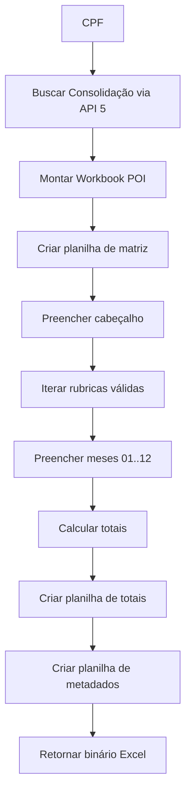

# API_6_EXCEL_EXPORT.md
# 📗 API 6 — Exportação de Consolidação para Excel (Apache POI)

Esta API gera o **arquivo Excel final**, no mesmo formato da planilha consolidada usada nos relatórios financeiros.  
O Excel contém:

- Matriz ano/mês por rubrica
- Totais mensais
- Total geral
- Formatação idêntica ao modelo fornecido
- Separação por rubricas válidas
- Conversão automática para valores numéricos

---

# 1. ENDPOINT PRINCIPAL

## ▶️ GET /api/v1/persons/{cpf}/excel

### Query Params opcionais

| Param | Exemplo | Descrição |
|--------|----------|------------|
| ano | 2017 | Gera Excel apenas de 1 ano |
| origem | CAIXA | Filtra CAIXA/FUNCEF/MIX |

---

# 2. RESPONSE

### Cabeçalho
```
Content-Type: application/vnd.openxmlformats-officedocument.spreadsheetml.sheet
Content-Disposition: attachment; filename=consolidado_{cpf}.xlsx
```

### Corpo
Binário do arquivo Excel.

---

# 3. ESTRUTURA DO ARQUIVO EXCEL

## Aba 1 — Consolidação

| Código | Rubrica | 2017/01 | 2017/02 | ... | 2017/12 | Total |
|--------|---------|----------|----------|------|-----------|--------|
| 4482 | CONTRIB EXTRA 2015 | 424,10 | 885,47 | 0 | ... | 1309,57 |

### Requisitos:

✔ Valores numéricos reais (não texto)  
✔ Totais calculados por fórmula ou preenchidos direto  
✔ Cabeçalho fixo com fundo cinza claro  
✔ Fonte padrão: Arial 10  
✔ Colunas ajustadas automaticamente  
✔ Linha superior congelada (freeze pane)  

---

## Aba 2 — Totais Mensais

| Mês/Ano | Total |
|---------|--------|
| 2017/01 | 700.31 |
| 2017/02 | 3363.20 |
| ... | ... |

---

## Aba 3 — Metadados

```json
{
  "cpf": "12449709568",
  "nome": "FLAVIO JOSE PEREIRA ALMEIDA",
  "anos": ["2016","2017","2018"],
  "origem": "MISTO",
  "geradoEm": "2024-03-10T22:41:10Z"
}
```

---

# 4. PIPELINE DE GERAÇÃO DO EXCEL



---

# 5. FORMATAÇÃO OBRIGATÓRIA (Apache POI)

### Estilos:

- **headerStyle**
  - fundo: `GREY_25_PERCENT`
  - negrito
  - borda fina
- **numberStyle**
  - formato: `#,##0.00`
  - alinhamento à direita
- **defaultStyle**
  - fonte Arial 10
- **totalStyle**
  - fundo: `YELLOW`
  - negrito
  - borda dupla

### Celulas mescladas:
- Título principal da planilha (A1:G1)

---

# 6. DADOS OBRIGATÓRIOS

A API 6 usa diretamente o resultado da API 5:

```
ConsolidationResponse
  cpf
  nome
  anos
  meses
  rubricas[]
  totaisMensais{}
  totalGeral
```

---

# 7. LÓGICA DE PREPARAÇÃO DOS DADOS

1. Ordenar rubricas pela ordem da lista oficial (24 rubricas)  
2. Preencher meses faltantes com `0`  
3. Se `ano` for fornecido, descartar todos os demais  
4. Se `origem` for fornecido, somar apenas entries correspondentes  
5. Garantir matriz de:

```
totalRubricas * 12 meses
```

---

# 8. ERROS POSSÍVEIS

| Erro | Status | Descrição |
|------|--------|-----------|
| PERSON_NOT_FOUND | 404 | CPF inexistente |
| NO_ENTRIES_FOUND | 204 | Não há dados |
| ERROR_GENERATING_EXCEL | 500 | Falha no POI |
| INVALID_YEAR | 400 | Ano inválido |

---

# 9. ORDEM DE IMPLEMENTAÇÃO

1. Criar classe `ExcelExportService`
2. Criar builder de workbook POI
3. Implementar estilos (header, number, total)
4. Implementar planilha principal
5. Implementar planilha de totais
6. Implementar planilha de metadados
7. Testar com PDFs reais (multi anos)
8. Testar em arquivos grandes (5+ MB)
9. Criar controller `ExcelController`
10. Gerar download com `Mono<ResponseEntity<ByteArray>>`

---

# 10. CLASSES NECESSÁRIAS

- `ExcelExportService`
- `PoiWorkbookBuilder`
- `ExcelMatrixSheetBuilder`
- `ExcelTotalsSheetBuilder`
- `ExcelMetadataSheetBuilder`
- `ExcelController`

---

Fim da documentação da API 6 — Exportação de Excel.
