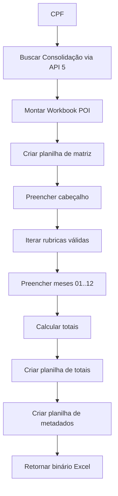

# API_6_EXCEL_EXPORT.md
# 📗 API 6 — Exportação de Consolidação para Excel (Apache POI)

Esta API gera o **arquivo Excel final**, no mesmo formato da planilha consolidada usada nos relatórios financeiros.  
O Excel contém:

- Matriz ano/mês por rubrica
- Totais mensais
- Total geral
- Formatação idêntica ao modelo fornecido
- Separação por rubricas válidas
- Conversão automática para valores numéricos

---

# 1. ENDPOINT PRINCIPAL

## ▶️ GET /api/v1/persons/{cpf}/excel

### Query Params opcionais

| Param | Exemplo | Descrição |
|--------|----------|------------|
| ano | 2017 | Gera Excel apenas de 1 ano |
| origem | CAIXA | Filtra CAIXA/FUNCEF/MIX |

---

# 2. RESPONSE

### Cabeçalho
```
Content-Type: application/vnd.openxmlformats-officedocument.spreadsheetml.sheet
Content-Disposition: attachment; filename=consolidado_{cpf}.xlsx
```

### Corpo
Binário do arquivo Excel.

---

# 3. ESTRUTURA DO ARQUIVO EXCEL

## Aba 1 — Consolidação

| Código | Rubrica | 2017/01 | 2017/02 | ... | 2017/12 | Total |
|--------|---------|----------|----------|------|-----------|--------|
| 4482 | CONTRIB EXTRA 2015 | 424,10 | 885,47 | 0 | ... | 1309,57 |

### Requisitos:

✔ Valores numéricos reais (não texto)  
✔ Totais calculados por fórmula ou preenchidos direto  
✔ Cabeçalho fixo com fundo cinza claro  
✔ Fonte padrão: Arial 10  
✔ Colunas ajustadas automaticamente  
✔ Linha superior congelada (freeze pane)  

---

## Aba 2 — Totais Mensais

| Mês/Ano | Total |
|---------|--------|
| 2017/01 | 700.31 |
| 2017/02 | 3363.20 |
| ... | ... |

---

## Aba 3 — Metadados

```json
{
  "cpf": "12449709568",
  "nome": "FLAVIO JOSE PEREIRA ALMEIDA",
  "anos": ["2016","2017","2018"],
  "origem": "MISTO",
  "geradoEm": "2024-03-10T22:41:10Z"
}
```

---

# 4. PIPELINE DE GERAÇÃO DO EXCEL


```mermaid
flowchart TD
    A[CPF] --> B[Buscar Consolidação via API 5]
    B --> C[Montar Workbook POI]
    C --> D[Criar planilha de matriz]
    D --> E[Preencher cabeçalho]
    E --> F[Iterar rubricas válidas]
    F --> G[Preencher meses 01..12]
    G --> H[Calcular totais]
    H --> I[Criar planilha de totais]
    I --> J[Criar planilha de metadados]
    J --> K[Retornar binário Excel]
```

---

# 5. FORMATAÇÃO OBRIGATÓRIA (Apache POI)

### Estilos:

- **headerStyle**
  - fundo: `GREY_25_PERCENT`
  - negrito
  - borda fina
- **numberStyle**
  - formato: `#,##0.00`
  - alinhamento à direita
- **defaultStyle**
  - fonte Arial 10
- **totalStyle**
  - fundo: `YELLOW`
  - negrito
  - borda dupla

### Celulas mescladas:
- Título principal da planilha (A1:G1)

---

# 6. DADOS OBRIGATÓRIOS

A API 6 usa diretamente o resultado da API 5:

```
ConsolidationResponse
  cpf
  nome
  anos
  meses
  rubricas[]
  totaisMensais{}
  totalGeral
```

---

# 7. LÓGICA DE PREPARAÇÃO DOS DADOS

1. Ordenar rubricas pela ordem da lista oficial (24 rubricas)  
2. Preencher meses faltantes com `0`  
3. Se `ano` for fornecido, descartar todos os demais  
4. Se `origem` for fornecido, somar apenas entries correspondentes  
5. Garantir matriz de:

```
totalRubricas * 12 meses
```

---

# 8. ERROS POSSÍVEIS

| Erro | Status | Descrição |
|------|--------|-----------|
| PERSON_NOT_FOUND | 404 | CPF inexistente |
| NO_ENTRIES_FOUND | 204 | Não há dados |
| ERROR_GENERATING_EXCEL | 500 | Falha no POI |
| INVALID_YEAR | 400 | Ano inválido |

---

# 9. ORDEM DE IMPLEMENTAÇÃO

1. Criar classe `ExcelExportService`
2. Criar builder de workbook POI
3. Implementar estilos (header, number, total)
4. Implementar planilha principal
5. Implementar planilha de totais
6. Implementar planilha de metadados
7. Testar com PDFs reais (multi anos)
8. Testar em arquivos grandes (5+ MB)
9. Criar controller `ExcelController`
10. Gerar download com `Mono<ResponseEntity<ByteArray>>`

---

# 10. CLASSES NECESSÁRIAS

- `ExcelExportService`
- `PoiWorkbookBuilder`
- `ExcelMatrixSheetBuilder`
- `ExcelTotalsSheetBuilder`
- `ExcelMetadataSheetBuilder`
- `ExcelController`

---

# 11. Simulação IRPF na aba anual (dois blocos)

Quando existe declaração IRPF importada para o ano-calendário da aba, `ConsolidationExcelServiceImpl` gera **dois blocos** distintos:

| # | Quando | Título | Conteúdo |
|---|--------|--------|----------|
| 1 | `tipoTributacao = SIMPLIFICADO` | `CONFORME DECLARAÇÃO ENTREGUE…` | **Espelho exato** do RESUMO simplificado (desconto simplificado, imposto devido/pago/resultado) — **sem motor**, valores do PDF |
| 1 | `tipoTributacao = COMPLETO` | `CONFORME DECLARAÇÃO ENTREGUE…` | **Espelho exato** do RESUMO com deduções legais (rendimentos, deduções, imposto devido/pago/resultado) — **sem motor**, valores do PDF |
| 2 | **Sempre** | `SIMULAÇÃO IRPF… COM APROVEITAMENTO DAS CONTRIBUIÇÕES EXTRAS` | Modelo **Completo** via `IrSimuladorMotorService` com prev. complementar da **planilha de contracheques** (verde) |

### Bloco 1 — Declaração Simplificada entregue

- Rendimentos tributáveis (7 sub-linhas + total)
- Desconto simplificado, base, imposto devido, RRA, alíquota, total devido
- Imposto pago (8 linhas + total), restituição, saldo a pagar
- Fonte: campos de `IrpfDeclaracaoData` extraídos do PDF (sem recálculo)

### Bloco 1 — Declaração Completa entregue (deduções legais)

- Rendimentos tributáveis (7 sub-linhas + total)
- Deduções (10 linhas do RESUMO + nota 12% + **TOTAL**)
- Imposto devido (base, imposto devido, dedução incentivo, imposto devido I/II, RRA, alíquota, total)
- Imposto pago (8 linhas + total), restituição, saldo a pagar
- Fonte: `ExcelIrpfDeducoesResumoHelper.montarConformeDeclaracao` + campos de `IrpfDeclaracaoData` (sem motor)

### Bloco 2 — Simulação Completa + planilha

- Seção **RENDIMENTOS TRIBUTÁVEIS** (igual ao bloco 1)
- Seção **DEDUÇÕES** com rótulos do RESUMO IRPF (prev. oficial, prev. compl. limitada a 12%, médicas, etc.)
- **INSS doméstico** não entra nas deduções — aplica-se como **crédito** (Imposto devido II = Imposto devido I − INSS). Sem INSS doméstico, Imposto devido II exibe **0,00** no bloco 2 e é omitido no bloco 1; total devido = Imposto devido I + RRA.
- Imposto devido, pago (valores da declaração) e resultado (saldo = total devido − total pago)
- Prev. complementar da planilha destacada em verde

**Deduções:** `ExcelIrpfDeducoesResumoHelper` centraliza linhas do RESUMO; `ExcelIrpfSimulacaoMapper` com `preferirPrevidenciaPlanilha=true`; `IrpfPrevidenciaOficialResolver` soma prev. oficial das fontes pagadoras PJ.

**Motor:** flag `inssDomesticoComoCreditoImposto` em `SimuladorIrpfRequest` para alinhar ao RESUMO da Receita.

**Layout (colunas B:F):** título B:F; rótulos B:E, valor F; totais com fundo amarelo.

Classes envolvidas:

- `ConsolidationExcelServiceImpl` — `addBlocoConformeDeclaracaoSimplificada`, `addBlocoConformeDeclaracaoCompleta`, `addBlocoSimulacaoCompletaPlanilha`
- `ExcelIrpfDeducoesResumoHelper` / `ExcelIrpfDeducoesResumoDTO` — `montarConformeDeclaracao` (espelho) e `montar` (simulação planilha)
- `ExcelIrpfSimulacaoMapper` — mapeamento declaração → request
- `ModoSimulacaoExcel` — `ESPELHO_ENTREGUE` | `SIMULACAO_COMPLETA_PLANILHA`
- `IrSimuladorMotorService` — cálculo progressivo + crédito INSS doméstico

Regressão: Elizete AC 2018 — `Elizete2018ExcelSimulacaoLayoutTest`; Elizete AC 2019 — `Elizete2019ExcelSimulacaoLayoutTest`; Elizabeth AC 2016 — `ExcelIrpfSimulacaoTest`; Resumo Geral — `ElizeteResumoGeralTest`.

---

# 12. Aba "Resumo Geral"

Quando existem declarações IRPF importadas **cujo ano-calendário coincide com um ano de contracheque processado**, `ConsolidationExcelServiceImpl` gera a aba **"Resumo Geral"** (após as abas anuais, antes de **Consolidação**).

**Regra de alinhamento:** apenas declarações cujo **ano-calendário** está presente na consolidação de contracheques entram no Excel. Ex.: contracheque de 2016 → usa declaração **exercício 2017 / ano-calendário 2016**; declaração **exercício 2016 / ano-calendário 2015** é ignorada se não houver contracheque de 2015.

### Colunas por ano-calendário (somente anos com contracheque e declaração)

| Coluna | Origem | Regra |
|--------|--------|-------|
| A — Calendário | ano da aba | Ano-calendário |
| B — Valores Restituídos / Pagos | Bloco 1 (declaração entregue) | Valor positivo entre `IMPOSTO A RESTITUIR` e `SALDO IMPOSTO A PAGAR` |
| C — Valor Devido e ou a Restituir | Bloco 2 (simulação planilha) | Valor positivo entre restituição e saldo (`total devido − total pago` via motor) |
| D — Principal PGFN | derivado | `max(B − C, 0)` |
| E — SELIC Acumulada RFB | `TaxaSelicService.calcularSelicReceitaFederal` | Taxa acumulada (%); só se `D > 0` |
| F — Valor Correção R$ | SELIC | `valorCorrigido − D` |
| G — Principal + Correção | derivado | `D + F` |
| H — Observações | derivado | `"impacto financeiro"` se `D > 0`; senão `"sem impacto financeiro -sistema de tributação"` |

### Totais e rodapé

- **Total da diferença R$** — soma de D, F e G
- **Honorários Advocatícios — {sigla ou Contratual} — {N}%** — percentual sobre total G (padrão **12%** quando o cliente não tem empresa/percentual vinculado)
- **Valor a Receber** — total G − honorários

### Percentual de honorários por cliente

O percentual aplicado na linha de honorários é resolvido por `EmpresaHonorariosResolver` a partir do vínculo do cliente (`Person.empresaId` + `Person.percentualHonorarioId`):

1. Se o cliente possui empresa e percentual vigente cadastrados → usa o percentual da empresa (ex.: APCEF 15%).
2. Caso contrário → fallback **12%** (`ExcelResumoGeralHelper.PERCENTUAL_HONORARIOS_DEFAULT`).

O rótulo da linha segue o padrão `Honorários Advocatícios - {SIGLA} - {N}%` (ex.: `Honorários Advocatícios - APCEF - 12%`); sem empresa vinculada, usa `Contratual` no lugar da sigla.

Regressão: `ElizeteResumoGeralTest` (12% padrão e percentual customizado 15%).
- Rodapé com responsável técnico (constantes em `ExcelResumoGeralHelper`)

### SELIC

- **dataVencimento** — mapa estático por ano-calendário (`ExcelResumoGeralHelper.DATAS_VENCIMENTO`), exibido no cabeçalho "Datas para atualização"
- **dataPagamento (fim)** — `LocalDate.now()` na geração do Excel (colunas E/F/G variam com a data)

### Layout visual

- **Colunas A–G:** largura fixa ~105 px (15 caracteres); **coluna H:** ~280 px (40 caracteres)
- **Borda externa espessa** (`MEDIUM`) em torno do bloco principal (A1:H até "Valor a Receber")
- Bordas internas finas na tabela; linha dupla (`DOUBLE`) nas linhas de totais/honorários/valor a receber
- Rodapé (Responsável / CORECON) em caixa separada abaixo, com borda espessa própria
- Linha do economista: merge **B:F** com o texto CORECON; coluna **H** com data/hora de geração (`dd/MM/yyyy HH:mm`, fuso `America/Sao_Paulo`)
- Cabeçalho da tabela com fundo cinza e altura ~64 pt
- **Logo Origium** na área mesclada **G1:H8** (8 linhas × 2 colunas), recurso `excel/origium_logo.png`, ancorado com `MOVE_AND_RESIZE` para preencher a célula

### Classes envolvidas

- `ConsolidationExcelServiceImpl` — `addResumoGeralSheet`, orquestração reativa com `TaxaSelicService`
- `ExcelResumoGeralHelper` — regras B–H, mapa de datas, totais e honorários
- `ExcelResumoGeralLinhaDTO` — linha por ano + `enriquecerComSelic`
- `ExcelResumoGeralLogoHelper` — merge G1:H8 e inserção do logo Origium

---

Fim da documentação da API 6 — Exportação de Excel.
