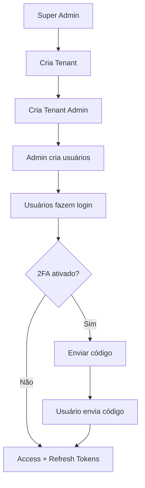

# 🔐 DOCUMENTAÇÃO CONSOLIDADA — MULTI-TENANCY COMPLETO

## Sistema Multi-Tenant — Autenticação, Isolamento e Segurança

**Arquitetura completa, detalhada e pronta para implementação**

**Clean Architecture + DDD + WebFlux + MongoDB Reactive**

---

# 📋 ÍNDICE

1. [Visão Geral e Objetivos](#1-visão-geral-e-objetivos)
2. [Modelo Multi-Tenant e Princípios](#2-modelo-multi-tenant-e-princípios)
3. [Modelos de Domínio (DDD)](#3-modelos-de-domínio-ddd)
4. [Autenticação e Autorização](#4-autenticação-e-autorização)
5. [Tenant Context e Isolamento](#5-tenant-context-e-isolamento)
6. [Tenant Filter (Implementação)](#6-tenant-filter-implementação)
7. [Arquitetura de Segurança](#7-arquitetura-de-segurança)
8. [Endpoints e APIs](#8-endpoints-e-apis)
9. [Fluxos e Diagramas](#9-fluxos-e-diagramas)
10. [Checklist de Implementação](#10-checklist-de-implementação)

---

# 1. VISÃO GERAL E OBJETIVOS

## 1.1 Objetivo Principal

Fornecer um sistema de autenticação **corporativo, escalável e seguro**, suportando:

- **Multi-tenant real**, com isolamento total por empresa
- **Super Admin global**
- **Admins e usuários por empresa (tenant)**
- **JWT Access Token + Refresh Token rotativo**
- **2FA opcional (global, per-tenant, per-usuário)**
- **Controle completo de segurança (lockout, brute-force, auditoria)**
- **Compatível com WebFlux (reativo)**
- **MongoDB (Reactive Repository)**
- **Em conformidade com SOLID + DDD + Clean Architecture**

## 1.2 Objetivos de Segurança

✔ Garantir que cada empresa tenha acesso somente a seus próprios dados

✔ Proteger a autenticação contra ataques de força bruta

✔ Garantir integridade dos tokens

✔ Evitar roubo de sessão via Refresh Token Rotativo

✔ Permitir auditoria completa de ações críticas

✔ Impedir vazamentos acidentais entre tenants

✔ Segurança consistente em ambiente WebFlux reativo

---

# 2. MODELO MULTI-TENANT E PRINCÍPIOS

## 2.1 Modelo Adotado (Modelo A — E-mail Único Global)

O usuário faz login **SOMENTE com**:

```
email + senha
```

O email é **único globalmente**, garantindo:

- Sem ambiguidade entre empresas
- UX mais simples
- Token JWT já contém o tenant automaticamente

Cada usuário pertence a **exatamente 1 tenant**, exceto o **super admin**.

## 2.2 Princípios do Domínio Multi-Tenant

### 2.2.1 Cada entidade pertence a um único tenant

Todas as entidades possuem obrigatoriamente:

```
tenantId: String
```

### 2.2.2 SUPER_ADMIN pode ignorar tenant

Tenants diferentes nunca se cruzam.

### 2.2.3 Isolamento por default

Repos padrões:

- `findByTenantId(...)`
- `findByTenantIdAndId(...)`
- `findAllByTenantId(...)`

### 2.2.4 Entidades não conhecem a persistência

Seguem 100% Clean Architecture.

## 2.3 Regras de Isolamento (Fundamental)

✔ Um usuário NUNCA pode acessar dados de outro tenant

✔ tenantId é obrigatório em todas collections

✔ Todas queries precisam incluir filtro:

```
find({ tenantId: currentTenant })
```

✔ SUPER_ADMIN pode acessar qualquer tenant manualmente informando X-Tenant-ID

✔ Nenhum payload retornado deve incluir dados de outro tenant

---

# 3. MODELOS DE DOMÍNIO (DDD)

## 3.1 Estrutura de Diretórios

```
domain/
    model/
    repository/
    service/
    exceptions/
```

## 3.2 MODEL: Tenant (Empresa)

Representa uma empresa que usa o sistema.

```json
{
  "id": "tenant123",
  "nome": "Empresa XPTO",
  "dominio": "xpto.com.br",
  "ativo": true,
  "createdAt": "2025-02-01T12:00:00Z",
  "config": {
    "twoFactorRequired": false,
    "maxUsers": 20
  }
}
```

### Campos e Regras

| Campo | Tipo | Regra |
|-------|------|-------|
| id | String | UUID gerado pelo sistema |
| nome | String | obrigatório |
| dominio | String | opcional (login por domínio) |
| ativo | Boolean | SUPER_ADMIN controla |
| config.twoFactorRequired | Boolean | força 2FA em todos usuários do tenant |
| config.maxUsers | Int | controle de licenças |

## 3.3 MODEL: User (Vinculado ao Tenant)

Cada usuário pertence a apenas 1 tenant.

```json
{
  "id": "user123",
  "tenantId": "tenant123",
  "nome": "Administrador XPTO",
  "email": "admin@xpto.com.br",
  "senhaHash": "argon2id...",
  "roles": ["TENANT_ADMIN"],
  "twoFactorEnabled": true,
  "twoFactorTempCode": null,
  "twoFactorTempCodeExpires": null,
  "refreshTokens": [],
  "ativo": true,
  "createdAt": "2024-03-10T09:00:00Z"
}
```

### Regras Essenciais

✔ email é globalmente único, independentemente do tenant

✔ user só acessa seu tenant

✔ roles definem permissões: SUPER_ADMIN, TENANT_ADMIN, TENANT_USER

✔ controle de 2FA individual

✔ múltiplos refresh tokens rotativos

## 3.4 MODEL: Person (Titular dos Contracheques)

```json
{
  "tenantId": "tenant123",
  "cpf": "12449709568",
  "nome": "FLAVIO ALMEIDA",
  "documentos": ["doc123", "doc456"]
}
```

### Regras

| Item | Regra |
|------|-------|
| CPF | único por tenant |
| documentos | lista de documentos pertencentes ao tenant |

## 3.5 MODEL: PayrollDocument (Documento PDF Processado)

```json
{
  "id": "doc123",
  "tenantId": "tenant123",
  "cpf": "12449709568",
  "tipo": "CAIXA | FUNCEF | MISTO",
  "ano": 2018,
  "status": "PENDING | PROCESSING | PROCESSED | ERROR",
  "pages": [
    { "page": 1, "origem": "CAIXA" },
    { "page": 2, "origem": "FUNCEF" }
  ],
  "createdAt": "2025-01-10T12:00:00Z",
  "uploadedBy": "user123"
}
```

### Regras

✔ Documentos sempre pertencem a um tenant

✔ O tipo do documento é detectado automaticamente

✔ Status segue workflow: `PENDING → PROCESSING → PROCESSED | ERROR`

## 3.6 MODEL: PayrollEntry (Rubrica Extraída)

```json
{
  "tenantId": "tenant123",
  "documentId": "doc123",
  "rubricaCodigo": "4482",
  "rubricaDescricao": "CONTRIBUIÇÃO EXTRAORDINÁRIA 2015",
  "referencia": "2017-08",
  "valor": 885.47,
  "pagina": 1,
  "origem": "CAIXA"
}
```

### Regras

- obrigatório: tenantId, documentId, rubricaCodigo, valor
- referência sempre normalizada para yyyy-MM
- ligação forte com rubricas cadastradas
- pertence ao mesmo tenant do documento

## 3.7 MODEL: Rubrica (Global ou por Tenant)

Existem dois modos:

✔ **Modelo 1 — Rubricas Globais (recomendado)**

- Criadas pelo SUPER_ADMIN
- Afetam todos os tenants

✔ **Modelo 2 — Rubricas Customizadas por Tenant**

```json
{
  "tenantId": "GLOBAL or tenant123",
  "codigo": "4430",
  "descricao": "CONTRIBUIÇÃO EXTRAORDINÁRIA 2014",
  "categoria": "Administrativa",
  "ativo": true
}
```

## 3.8 MODEL: Consolidation (Resultado Consolidado)

```json
{
  "tenantId": "tenant123",
  "cpf": "12449709568",
  "ano": 2018,
  "matriz": [
    {
      "codigo": "4482",
      "janeiro": 885.47,
      "fevereiro": 0,
      ...
      "dezembro": 921.00
    }
  ],
  "generatedAt": "2025-01-11T08:24:00Z"
}
```

### Regras

✔ consolidação só pode mostrar dados do tenant

✔ matrizes podem ser regeneradas sob demanda

## 3.9 MODEL: AuditLog (Auditoria)

```json
{
  "tenantId": "tenant123",
  "userId": "user123",
  "timestamp": "2025-01-10T19:25:10Z",
  "evento": "LOGIN_FAILED",
  "detalhes": { "ip": "10.10.10.10" }
}
```

## 3.10 Contratos do Domínio (Interfaces)

### UserRepository

```java
interface UserRepository {
    Mono<User> findByEmail(String email);
    Mono<User> findByTenantIdAndId(String tenantId, String id);
    Mono<User> save(User user);
}
```

### PayrollDocumentRepository

```java
interface PayrollDocumentRepository {
    Mono<PayrollDocument> findByTenantIdAndId(String tenantId, String id);
    Flux<PayrollDocument> findAllByTenantIdAndCpf(String tenantId, String cpf);
}
```

## 3.11 Agregações (DDD)

| Aggregate | Entities incluídas |
|-----------|-------------------|
| Tenant | TenantConfig |
| User | RefreshTokens, 2FA |
| Person | PayrollDocument, PayrollEntry |
| Rubrica | Global e custom |
| Consolidation | matriz consolidada |

## 3.12 Regras de Negócio Importantes

✔ Todo modelo tem tenantId

✔ SUPER_ADMIN pode ignorar tenant

✔ Não existe relação entre tenants diferentes

✔ Rubricas globais + customizadas coexistem

✔ Users são únicos no sistema inteiro

✔ CPF é único por tenant, não global

✔ Uma consolidação só olha dados do tenant

---

# 4. AUTENTICAÇÃO E AUTORIZAÇÃO

## 4.1 Modelo de Autenticação

| Componente | Padrão |
|------------|--------|
| Access Token | JWT HS512/RS256 — 15 min |
| Refresh Token | UUID seguro — 30 dias |
| 2FA | código de 6 dígitos (email) |
| Password Hashing | Argon2id (OWASP recomendado) |
| Contexto de Segurança | ReactiveSecurityContextHolder |

## 4.2 JWT — Access Token

### Payload Padrão

```json
{
  "sub": "user123",
  "tenantId": "tenant123",
  "email": "admin@empresa.com",
  "roles": ["TENANT_ADMIN"],
  "iat": 1710000000,
  "exp": 1710000900,
  "jti": "uuid-jti-token"
}
```

### JWT Super Admin

```json
{
  "sub": "root",
  "roles": ["SUPER_ADMIN"],
  "iat": 1710090000,
  "exp": 1710090900
}
```

### Regras JWT

✔ Deve incluir tenantId (exceto SUPER_ADMIN)

✔ Deve incluir roles

✔ Deve incluir jti (ID único para revogação)

✔ Não pode incluir dados sensíveis

✔ Expiração curta (15 min)

## 4.3 Refresh Token

### Implementação

- formato: uuid-v4
- armazenado no Mongo + data de expiração
- atrelado ao usuário (e tenant)
- rotativo → ao usar, gera outro e invalida o antigo

### Fluxo

1. Usuário envia refresh
2. Sistema valida no Mongo
3. Se válido → cria novo Refresh + novo Access
4. Se o token já tiver sido usado antes → logout global

## 4.4 2FA — Autenticação em Duas Etapas

### Geração

- código de 6 dígitos (000000–999999)
- expira em 5 minutos
- apenas 1 código ativo por usuário
- reenviar só após 60s

### Armazenamento

```json
{
  "twoFactorTempCode": "493201",
  "twoFactorTempCodeExpires": "2025-01-10T11:54:00Z",
  "twoFactorEnabled": true
}
```

### 2FA Hierárquico

2FA pode ser ativado:

- globalmente (`force2faGlobal`)
- por tenant (`tenant.config.twoFactorRequired`)
- por usuário (`user.twoFactorEnabled`)

**Regra final:**

```
2FA = force2faGlobal OR tenant.config.twoFactorRequired OR user.twoFactorEnabled
```

### Cenários

| Configuração | Efeito |
|--------------|--------|
| twoFactorForceGlobal = true | Todo login deve passar 2FA |
| user.twoFactorEnabled = true | Somente usuários marcados |

## 4.5 Roles e Permissões (RBAC)

| Papel | Escopo | Permissões |
|-------|--------|------------|
| SUPER_ADMIN | Global | Gerencia tenants e admins, acessa qualquer tenant |
| TENANT_ADMIN | Dentro do tenant | Cria usuários, gerencia documentos, rubricas customizadas |
| TENANT_USER | Dentro do tenant | Upload documentos, visualizar próprios resultados |

### Regras de Autorização

✔ SUPER_ADMIN ignora tenant

✔ TENANT_ADMIN não pode modificar outro tenant

✔ TENANT_USER não pode ver dados de outros usuários

---

# 5. TENANT CONTEXT E ISOLAMENTO

## 5.1 Tenant Context (Requisito Essencial)

Toda request deve carregar informação sobre qual tenant está sendo acessado.

Há três formas de detectar o tenant:

### 5.1.1 TENANT POR JWT (mais seguro)

O JwtService deve incluir no token:

```json
{
  "sub": "user123",
  "tenantId": "tenant123",
  "roles": ["TENANT_ADMIN"],
  "exp": 1710090900
}
```

O filtro de segurança extrai:

```
TenantContext.setCurrentTenant(jwt.tenantId)
```

### 5.1.2 TENANT POR HEADER (suporte opcional)

Request deve incluir:

```
X-Tenant-ID: tenant123
```

Só válido para:

- processamento interno
- super-admin acessando outros tenants

### 5.1.3 TENANT POR DOMÍNIO (modo SaaS avançado)

Exemplo:

- empresaA.sistema.com → tenantA
- empresaB.sistema.com → tenantB

A aplicação extrai subdomínio → resolve tenantId.

## 5.2 Estrutura do Tenant Context

### Versão Java (ThreadLocal)

```java
public final class TenantContext {
    private static final ThreadLocal<String> currentTenant = new ThreadLocal<>();

    public static void setTenant(String tenantId) {
        currentTenant.set(tenantId);
    }

    public static String getTenant() {
        return currentTenant.get();
    }

    public static void clear() {
        currentTenant.remove();
    }
}
```

### Versão WebFlux (Reactive Context)

```kotlin
fun <T> Mono<T>.withTenant(tenantId: String): Mono<T> =
    this.contextWrite { ctx -> ctx.put("tenantId", tenantId) }
```

## 5.3 Como o Mongo Isola Dados (Row-Level Security)

Cada collection deve conter tenantId:

### persons

```json
{
  "tenantId": "tenant123",
  "cpf": "12449709568",
  "nome": "FLAVIO ALMEIDA",
  "documentos": ["doc123"]
}
```

### payroll_documents

```json
{
  "id": "doc123",
  "tenantId": "tenant123",
  "cpf": "12449709568",
  "tipo": "CAIXA",
  "status": "PROCESSED"
}
```

### payroll_entries

```json
{
  "tenantId": "tenant123",
  "documentId": "doc123",
  "rubricaCodigo": "4482",
  "valor": 885.47
}
```

## 5.4 Enforcamento do Tenant (Obrigatório)

Toda query deve usar:

```
find({ tenantId: TenantContext.get() })
```

Toda gravação deve incluir:

```
payload.tenantId = TenantContext.get()
```

---

# 6. TENANT FILTER (IMPLEMENTAÇÃO)

## 6.1 Objetivo do Tenant Filter

O Tenant Filter garante:

✔ Toda request autenticada possui tenantId

✔ Queries do Mongo sempre filtram tenantId

✔ Usuários nunca acessam outro tenant

✔ SUPER_ADMIN pode trocar o tenant via header

✔ WebFlux injeta o tenant no ReactiveContext

✔ Proteção contra vazamentos de dados entre empresas

## 6.2 Fonte do Tenant (Ordem de Prioridade)

| Ordem | Fonte | Exemplo | Uso |
|-------|-------|---------|-----|
| 1 | JWT (obrigatório) | `"tenantId": "tenant123"` | padrão |
| 2 | Header X-Tenant-ID | `X-Tenant-ID: abc123` | usado pelo SUPER_ADMIN |
| 3 | Subdomínio | `empresaA.sistema.com` | modo SaaS avançado |

O filtro resolve o tenant usando essa ordem.

Caso o usuário não seja SUPER_ADMIN, o sistema ignora headers e subdomínio e usa somente o tenant do JWT.

## 6.3 Estrutura do Filter (WebFlux)

Este filtro é executado antes de qualquer controller.

```java
@Component
public class TenantFilter implements WebFilter {

    @Override
    public Mono<Void> filter(ServerWebExchange exchange, WebFilterChain chain) {

        return resolveTenant(exchange)
            .flatMap(tenantId -> 
                chain.filter(exchange)
                     .contextWrite(ctx -> ctx.put("tenantId", tenantId))
            );
    }

    private Mono<String> resolveTenant(ServerWebExchange exchange) {

        String forcedTenant = exchange.getRequest().getHeaders().getFirst("X-Tenant-ID");

        return ReactiveSecurityUtils.getAuthenticatedUser()
            .flatMap(user -> {

                // SUPER_ADMIN pode mudar tenant
                if (forcedTenant != null && user.isSuperAdmin()) {
                    return Mono.just(forcedTenant);
                }

                // Usuários normais usam tenantId do JWT
                return Mono.just(user.getTenantId());
            });
    }
}
```

## 6.4 Como o Mongo Filtra por Tenant

### Repositório exemplo:

```java
public Mono<Person> findByCpf(String cpf) {

    return ReactiveTenantContext.getTenantId()
        .flatMap(tid ->
            mongoTemplate.findOne(
                Query.query(
                    Criteria.where("tenantId").is(tid)
                            .and("cpf").is(cpf)
                ),
                Person.class
            )
        );
}
```

Nenhuma query pode ser executada sem tenantId.

Caso contrário → erro fatal e log crítico.

## 6.5 Fluxo Completo do Tenant Filter

```
flowchart TD
    A[Request] --> B[Extrair JWT]
    B --> C{JWT válido?}
    C -->|Não| Z[401 Unauthorized]
    C -->|Sim| D[Extrair tenantId do token]

    D --> E{X-Tenant-ID presente?}
    E -->|Sim e SUPER_ADMIN| F[Substituir tenantId]
    E -->|Não| G[Usar tenantId do JWT]

    F --> H[Validar Tenant Ativo]
    G --> H[Validar Tenant Ativo]

    H --> I[Injetar tenant no ReactiveContext]
    I --> J[Executar Handler]
    J --> K[Limpar TenantContext]
```

## 6.6 Regras de Segurança Essenciais

✔ Usuário só pode acessar seu próprio tenant

✔ SUPER_ADMIN acessa qualquer tenant via X-Tenant-ID

✔ Toda response deve estar filtrada por tenant

✔ Qualquer ausência de tenantId → request bloqueada

✔ Toda query deve ter tenantId obrigatório

✔ Collections sem tenant são consideradas inseguras

## 6.7 Middleware Global de Enforcement (Obrigatório)

Cada request passa pelo filtro:

```
flowchart TD
  A[Request] --> B[Extrair JWT]
  B --> C[Validar Token]
  C --> D[Extrair tenantId]
  D --> E[Set TenantContext]
  E --> F[Executar Handler]
  F --> G[Limpar TenantContext]
```

---

# 7. ARQUITETURA DE SEGURANÇA

## 7.1 Hardening de Segurança

### 7.1.1 Hash de Senha (Argon2id)

**Parâmetros recomendados:**

- memória: 64 MB
- iterações: 3
- paralelismo: 4

### 7.1.2 Rate Limiting / Anti-Bruteforce

**Aplicado a:**

- `/auth/login`
- `/auth/verify-2fa`
- `/auth/refresh`

**Mecanismos:**

- X tentativas → bloqueio temporário
- rate-limit por IP + por email
- logs de tentativas

### 7.1.3 Headers de Segurança

**Adicionar via WebFilter:**

- `X-Frame-Options: DENY`
- `X-Content-Type-Options: nosniff`
- `Referrer-Policy: no-referrer`
- `Cache-Control: no-store`
- `Permissions-Policy: ...`
- `Strict-Transport-Security: max-age=31536000`

### 7.1.4 Segurança CORS

**Aceitar apenas:**

- domínios autorizados por tenant
- métodos e headers específicos

## 7.2 Segurança no Tratamento de PDF

✔ PDFBox + Apache Tika

✔ Timeouts para processamento

✔ Rejeitar PDFs com mais de X páginas

✔ Rejeitar PDFs acima de X MB

✔ Sanitização dos textos extraídos

✔ Nenhum arquivo é executado — apenas leitura binária

## 7.3 Segurança no MongoDB

**Modo recomendado:**

- usar índices por tenantId
- validar duplicação por tenant
- criptografar volumes do banco
- logs desabilitam dados sensíveis

## 7.4 Segurança do Pipeline Reativo (WebFlux)

✔ Reactor Context carregando tenant

✔ JWT validado no filtro antes do handler

✔ Nunca bloquear threads (security-sensitive)

✔ Cancelar pipeline em caso de token inválido

## 7.5 Logging + Auditoria

Todos os eventos críticos devem ser registrados:

- login
- login inválido
- refresh usado
- refresh inválido
- tenant access override
- 2FA enviado
- 2FA falho
- criação de usuário
- exclusão de usuário
- upload de documento

**Formato:**

```json
{
  "timestamp": "...",
  "tenantId": "tenant123",
  "userId": "user123",
  "event": "LOGIN_FAILED",
  "metadata": { ... }
}
```

## 7.6 Segurança Avançada

✔ Hash de senha Argon2id

✔ Refresh token rotativo

✔ Auditoria de tentativas

✔ Lockout após 5 falhas

✔ Tempo mínimo entre códigos 2FA

✔ TTL automático em códigos 2FA

✔ Expiração de refresh de 30 dias

✔ Expiração de access de 15 minutos

✔ jti único por token (revogável)

---

# 8. ENDPOINTS E APIs

## 8.1 Criar Tenant (somente SUPER_ADMIN)

**POST /api/v1/tenants**

Request:

```json
{
  "nome": "Empresa XPTO"
}
```

Response:

```json
{
  "tenantId": "tenant123",
  "nome": "Empresa XPTO"
}
```

## 8.2 Criar Admin da Empresa

**POST /api/v1/tenants/{tenantId}/users/admin**

Request:

```json
{
  "nome": "João Silva",
  "email": "admin@empresa.com",
  "senha": "Senha123"
}
```

## 8.3 Criar Usuário da Empresa (Tenant Admin → Tenant User)

**POST /api/v1/users**

Request:

```json
{
  "nome": "Maria",
  "email": "maria@empresa.com",
  "senha": "12345",
  "roles": ["TENANT_USER"]
}
```

## 8.4 Login

**POST /api/v1/auth/login**

Request:

```json
{
  "email": "maria@empresa.com",
  "senha": "12345"
}
```

### Resposta sem 2FA

```json
{
  "accessToken": "...",
  "refreshToken": "..."
}
```

### Resposta com 2FA

```json
{
  "requires2FA": true,
  "message": "Código enviado por e-mail"
}
```

## 8.5 Verificação do código 2FA

**POST /api/v1/auth/verify-2fa**

Request:

```json
{
  "email": "maria@empresa.com",
  "code": "394812"
}
```

Response:

```json
{
  "accessToken": "...",
  "refreshToken": "..."
}
```

## 8.6 Refresh Token

**POST /api/v1/auth/refresh**

Request:

```json
{
  "refreshToken": "..."
}
```

## 8.7 Logout

**POST /api/v1/auth/logout**

## 8.8 Endpoints Multi-Tenant Aware

| API | Comportamento multi-tenant |
|-----|---------------------------|
| Rubricas | Se globais → ignorar tenantId. Se custom → filtrar. |
| Upload | Documento salvo com tenantId |
| Processamento PDF | Tudo filtrado por tenant |
| Consolidação | Apenas dados do tenant atual |
| Users | Apenas SUPER_ADMIN cria tenants |
| Auth | JWT inclui tenantId |
| Excel Export | gera Excel apenas do tenant atual |

---

# 9. FLUXOS E DIAGRAMAS

## 9.1 Fluxo Multi-Tenant Completo



## 9.2 Fluxo de Autenticação com 2FA

```
1. POST /auth/login (email + senha)
   ↓
2. Validar credenciais
   ↓
3. Verificar se 2FA é necessário
   ↓
4a. Se NÃO → Retornar accessToken + refreshToken
4b. Se SIM → Gerar código 2FA e enviar por email
   ↓
5. POST /auth/verify-2fa (email + code)
   ↓
6. Validar código
   ↓
7. Retornar accessToken + refreshToken
```

## 9.3 Fluxo de Refresh Token

```
1. POST /auth/refresh (refreshToken)
   ↓
2. Validar refreshToken no MongoDB
   ↓
3. Verificar se já foi usado (rotativo)
   ↓
4. Gerar novo accessToken + novo refreshToken
   ↓
5. Invalidar refreshToken antigo
   ↓
6. Retornar novos tokens
```

---

# 10. CHECKLIST DE IMPLEMENTAÇÃO

## 10.1 Checklist de Segurança

### 🔒 Autenticação

- [ ] JWT com expiração curta (15 min)
- [ ] Refresh rotativo
- [ ] Argon2id para hash de senha
- [ ] 2FA opcional/global
- [ ] jti único por token (revogável)

### 🏢 Multi-Tenancy

- [ ] tenantId obrigatório em todas collections
- [ ] ReactiveContext isolado
- [ ] SUPER_ADMIN limitado
- [ ] header X-Tenant-ID para override seguro
- [ ] Tenant Filter implementado
- [ ] Todas queries filtram por tenantId

### 🧱 API Security

- [ ] Rate limiting
- [ ] CORS seguro
- [ ] Headers de segurança
- [ ] Logging de auditoria
- [ ] Lockout após tentativas falhas

### 📄 PDF & Dados

- [ ] validações de tamanho
- [ ] validações de extensão
- [ ] sanitização de texto
- [ ] timeouts de processamento

## 10.2 Checklist de Modelos

| Item | ✔ |
|------|---|
| Todos modelos possuem tenantId | ✔ |
| Modelos seguem DDD | ✔ |
| Campos sensíveis nunca expostos | ✔ |
| Não existe dependência de infraestrutura | ✔ |
| Normalize: datas, valores, rubricas | ✔ |
| Repositórios são interfaces | ✔ |

## 10.3 Classes Necessárias

### Domain
- User
- Tenant
- RefreshToken
- TwoFactorCode
- Person
- PayrollDocument
- PayrollEntry
- Rubrica
- Consolidation
- AuditLog

### Application
- RegisterAdminUseCase
- RegisterUserUseCase
- LoginUseCase
- Verify2FAUseCase
- RefreshUseCase
- LogoutUseCase

### Infrastructure
- JwtService
- Argon2PasswordService
- EmailService
- TenantContextFilter
- MongoUserRepository
- MongoTenantRepository

## 10.4 Ordem de Implementação

1. Implementar TenantRepository
2. Criar Super Admin inicial
3. Criar fluxo de criação de tenants
4. Implementar UserRepository com tenantId
5. Implementar JwtService (com tenantId no payload)
6. Implementar PasswordService (Argon2id)
7. Criar AuthService (Login, Refresh, 2FA)
8. Criar TenantContextFilter (WebFlux)
9. Criar ReactiveTenantContext helper
10. Criar controllers (Auth, Tenant, User)
11. Implementar rate limiting
12. Implementar headers de segurança
13. Testes unitários
14. Testes WebFlux integrados
15. Testes de isolamento multi-tenant

## 10.5 Testes Obrigatórios

### 🔍 Testes Positivos

- Login retorna JWT com tenantId
- Todas as queries retornam apenas dados do tenant
- SUPER_ADMIN acessa outro tenant via header
- Subdomínio identifica tenant corretamente
- 2FA funciona corretamente
- Refresh token rotativo funciona

### 🔥 Testes Negativos

- Usuário tentando acessar outro tenant → 403
- Query sem tenantId → exceção
- Tenant desativado → 403
- X-Tenant-ID sendo usado por não-admin → 403
- Refresh token usado duas vezes → logout global
- Código 2FA expirado → erro

## 10.6 Recomendações Finais

✔ Segurança 100% alinhada com OWASP Top 10

✔ Suporte a SaaS multi-tenant seguro

✔ JWT + Refresh + 2FA + RBAC + Tenant Isolation

✔ Pipeline reativo seguro

✔ Modelos prontos para implementação em Clean Architecture

✔ Multi-Tenancy aplicado corretamente por design

✔ Alinhado com DDD, SOLID e boas práticas SaaS

---

# 📚 REFERÊNCIAS

Este documento consolida as informações de:

- `API_9_MULTI_TENANT_AUTH.md` — Autenticação Multi-Tenant
- `API_9_1_TENANT_CONTEXT.md` — Tenant Context e Isolamento
- `API_9_2_TENANT_FILTER.md` — Filtro Global de Multi-Tenancy
- `API_9_3_SECURITY_ARCHITECTURE.md` — Arquitetura de Segurança
- `API_9_4_DOMAIN_MODELS_MULTI_TENANT.md` — Modelos de Domínio

---

**Fim do documento consolidado — API_9_CONSOLIDADO_MULTI_TENANT.md**

