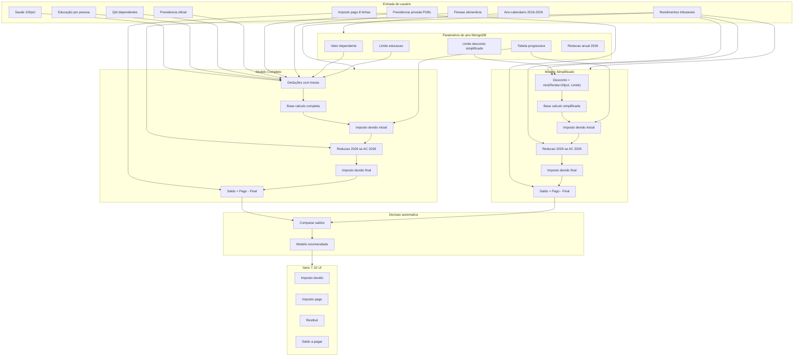

# Motor de Cálculo IRPF + Simulador (Itens 7–10)

Documentação oficial das regras de negócio, fluxo matemático, API e interface do simulador IRPF anual.

**Escopo:** anos-calendário **2016–2026** (tabela 2015 existe no MongoDB, mas fica fora do simulador).

---

## Objetivo

Substituir cálculos parciais ou duplicados por um **motor único no backend** que:

1. Recebe o ano-calendário (2016–2026) e os dados financeiros do usuário
2. Calcula **Modelo Completo** e **Modelo Simplificado** em paralelo
3. Aplica a tabela progressiva anual + redução anual 2026 (quando aplicável)
4. Calcula saldo (restituir / a pagar) para cada modelo
5. **Sugere automaticamente** o modelo mais vantajoso financeiramente
6. Alimenta os **itens 7–10** da declaração no frontend

---

## Arquitetura



### Componentes no código

| Componente | Caminho |
|------------|---------|
| Motor principal | `application/tributacao/IrSimuladorMotorService.java` |
| Cálculo progressivo (faixa a faixa + fórmula) | `application/tributacao/IrCalculoProgressivoService.java` |
| Tabelas/parametros MongoDB | `infrastructure/config/IrTributacaoSeedInitializer.java`, `IrTributacaoMigrationInitializer.java` |
| Endpoint simulação | `POST /tributacao/simular` em `IrTributacaoController.java` |
| Endpoint legado (cálculo simples) | `POST /tributacao/calcular` |
| Frontend simulador | `pdfprocessor-frontend/src/simulador-irpf/pages/simulador-irpf-page.tsx` |
| Tipos/API frontend | `pdfprocessor-frontend/src/tributacao/api/tributacao-api.ts` |
| Testes unitários | `IrSimuladorMotorServiceTest.java`, `IrCalculoProgressivoServiceTest.java` |

---

## 1. Estrutura de dados por ano-calendário

Cada ano-calendário possui parâmetros no MongoDB, retornados via `IrTributacaoService`:

| Campo do motor | Origem no banco |
|----------------|-----------------|
| `Valor_Dependente` | `parametros.deducaoDependente` |
| `Limite_Educacao` | `parametros.limiteInstrucao` |
| `Limite_Desconto_Simplificado` | `parametros.limiteDescontoSimplificado` (R$ 16.754,34 até 2025; **R$ 17.640,00** em 2026) |
| `Tabela_Progressiva` | `faixas[]` com `limiteInferior`, `limiteSuperior`, `aliquota`, `deducao` (Parcela a deduzir) |
| Redução anual 2026 | `reducaoAnualAtiva`, limites 60.000 / 88.200, constante 8.429,73, coeficiente 0,095575 |

Exemplo de faixa na tabela progressiva:

| Base de cálculo anual | Alíquota | Parcela a deduzir |
|-----------------------|----------|-------------------|
| Até R$ 22.847,76 | 0% | — |
| R$ 22.847,77 a R$ 33.919,80 | 7,5% | R$ 1.713,58 |
| … | … | … |

---

## 2. Modelo Completo (deduções legais)

Neste modelo, o imposto incide sobre a renda total menos as despesas dedutíveis comprovadas.

### Total de deduções

```
Total_Deducoes =
  min(PGBL, Rendimentos × 12%) +
  INSS (100%) +
  Pensão alimentícia (100%) +
  Saúde (100%) +
  Educação efetiva +
  (Quantidade_Dependentes × Valor_Dependente) +
  INSS patronal empregador doméstico (efetivo)
```

O termo **INSS patronal empregador doméstico** aplica-se **somente** aos anos-calendário **2016, 2017 e 2018** (Modelo Completo). A partir de **2019** o valor efetivo é **zero**, independentemente do input.

```
inssDomesticoEfetivo = (anoCalendario ≤ 2018)
  ? min(previdenciaEmpregadoDomestico, limiteInssDomestico do ano)
  : 0
```

| AC | Exercício | `limiteInssDomestico` (MongoDB) |
|----|-----------|----------------------------------|
| 2016 | 2017 | R$ 1.092,00 |
| 2017 | 2018 | R$ 1.171,84 |
| 2018 | 2019 | R$ 1.200,32 |
| 2019–2026 | 2020–2027 | R$ 0,00 (extinto) |

Limite de **1 empregado doméstico** por declaração — apenas trava matemática do teto anual.

### Regras por categoria

| Categoria | Regra |
|-----------|-------|
| **Saúde** | 100% dedutível, sem limite de valor |
| **Educação** | Limitada ao `Limite_Educacao` do ano, por titular/dependente/alimentando |
| **Dependentes** | `Quantidade × Valor_Dependente` do ano |
| **INSS (previdência oficial)** | 100% dedutível |
| **Pensão alimentícia** | 100% dedutível (decisão judicial ou escritura) |
| **PGBL (previdência privada)** | Limitado a **12%** dos rendimentos tributáveis totais. VGBL **não** deduz |
| **INSS patronal empregador doméstico** | AC 2016–2018: `min(valor, limiteInssDomestico)`. AC ≥ 2019: zero |

### Educação efetiva (limite individual por CPF)

A Receita Federal **não** agrupa os limites em um bolso único. Cada CPF (titular, dependente, alimentando) tem limite próprio:

```
educacaoEfetiva =
  min(gastoTitular, Limite_Educacao) +
  Σ min(gastoDep_i, Limite_Educacao) +
  Σ min(gastoAlim_j, Limite_Educacao)
```

**Exemplo (AC 2020, limite R$ 3.561,50):**

| Cenário | Pooled (errado) | Por CPF (correto) |
|---------|-----------------|-------------------|
| Titular R$ 7.000, 1 dependente R$ 0 | R$ 7.000 | R$ 3.561,50 |
| Titular R$ 10.000, 1 dependente R$ 2.000 | R$ 7.123 (pool) | R$ 5.561,50 |

Campos da API: `despesasInstrucaoTitular`, `despesasInstrucaoDependentes[]`, `despesasInstrucaoAlimentandos[]`.

### Base de cálculo completa

```
Base_Calculo_Completa = max(0, Rendimentos_Tributaveis − Total_Deducoes)
```

---

## 3. Modelo Simplificado (desconto padrão)

O contribuinte abre mão das deduções legais em troca de um desconto fixo de 20% sobre a renda, limitado a um teto anual.

```
Desconto_Teorico = Rendimentos_Tributaveis × 0,20
Desconto_Simplificado = min(Desconto_Teorico, Limite_Desconto_Simplificado_Do_Ano)
Base_Calculo_Simplificada = max(0, Rendimentos_Tributaveis − Desconto_Simplificado)
```

---

## 4. Tabela progressiva (ambos os modelos)

Com a base definida (Completa ou Simplificada), aplica-se a tabela do ano-calendário:

1. Identificar em qual faixa a base se enquadra
2. Calcular o imposto inicial:

```
Imposto_Devido_Inicial = max(0, (Base_Calculo × Aliquota) − Parcela_Deduzir)
```

**Implementação:**

- Fórmula direta: `IrCalculoProgressivoService.calcularImpostoFormula()`
- **Arredondamento imposto devido e alíquota efetiva:** truncamento em 2 casas (`ROUND_DOWN`), conforme programa SERPRO — não `HALF_UP`
- Demonstrativo faixa a faixa: soma progressiva com limites acumulados por `limiteSuperior` (somente exibição; imposto final usa fórmula)

Se a base cair na faixa isenta (alíquota 0%), o imposto inicial é **zero**.

### Alíquota efetiva

Calculada sobre os **rendimentos tributáveis totais** (renda bruta), não sobre a base após deduções:

```
Aliquota_Efetiva = (Total_Imposto_Devido / Rendimentos_Tributaveis) × 100
```

A alíquota efetiva tende a ser menor que a alíquota nominal da faixa, pois considera o efeito das deduções e da parcela isenta.

---

## 5. Redução anual — ano-calendário 2026 (Exercício 2027)

**Lei nº 15.270/2025.** Aplica-se **somente** ao ano-calendário 2026. Para anos anteriores:

```
Imposto_Devido_Final = Imposto_Devido_Inicial (− deduções especiais, se houver)
```

A redução usa **Rendimentos_Tributaveis** (renda comum), **não** a base de cálculo e **não** inclui `rendimentosRRA`.

| Condição | Regra |
|----------|-------|
| `Rendimentos ≤ 60.000,00` | Redução zera o imposto → `Imposto_Devido_Final = 0` |
| `60.000,01 ≤ Rendimentos ≤ 88.200,00` | `Valor_Reducao = 8.429,73 − (0,095575 × Rendimentos)` → `Final = max(0, Inicial − Reducao)` |
| `Rendimentos > 88.200,00` | Sem redução → `Final = Inicial` |

---

## 5.1 RRA — tributação exclusiva (isolamento estrito)

Rendimentos Recebidos Acumuladamente possuem **tributação exclusiva** (ficha própria no programa SERPRO).

| Campo | Uso |
|-------|-----|
| `rendimentosTributaveis` | Renda comum — entra na progressiva e na redução 2026 |
| `rendimentosRRA` | Renda RRA — **nunca** entra na progressiva nem na redução 2026 |
| `impostoDevidoRRA` | Imposto devido sobre RRA — soma **apenas** no total do item 7 |
| `impostoRetidoRRA` | Retenção paga sobre RRA — entra no item 8 (imposto pago) |

```
Rendimentos_Tributaveis  ≠  Rendimentos_RRA

Progressiva e Redução_2026 ← somente rendimentosTributaveis
Total_Item_7 = Imposto_Devido_I + impostoDevidoRRA
```

**Exemplo:** salário R$ 50.000 + RRA R$ 1.000.000 → redução 2026 avalia só R$ 50.000 (imposto comum zerado); o imposto sobre RRA informado separadamente não anula o benefício.

---

## 6. Deduções especiais (item 5 da UI)

Subtraídas do imposto **após** a redução anual (quando houver):

| Campo | Descrição |
|-------|-----------|
| Dedução de incentivo (cód. 40–43) | Soma ECA + Cultura + Desporto + Idoso; **teto 6%** do imposto após redução |
| PRONON (cód. 44) | **Teto 1%** do imposto após redução |
| PRONAS/PCD (cód. 45) | **Teto 1%** do imposto após redução |

Implementado em `IrDoacoesDeducaoCalculator` — cálculo em duas etapas: primeiro imposto após redução, depois aplicação dos tetos.

```
Imposto_Devido_Final = max(0, Imposto_Apos_Reducao − Deduções_Especiais)
```

---

## 7. Saldo final — restituir ou pagar

Para **cada** modelo (Completo e Simplificado):

```
Saldo = Imposto_Pago_Total − Imposto_Devido_Final
```

| Saldo | Resultado |
|-------|-----------|
| `> 0` | **Imposto a restituir** = saldo; saldo a pagar = 0 |
| `< 0` | **Saldo a pagar** = \|saldo\|; restituir = 0 |
| `= 0` | Ambos zero |

### Imposto pago total (item 8)

Soma das 8 linhas informadas pelo usuário:

```
Imposto_Pago =
  IRRF titular +
  IRRF dependentes +
  Carnê-Leão titular +
  Carnê-Leão dependentes +
  Imposto complementar +
  Imposto pago no exterior +
  IRRF (Lei 11.033/2004) +
  IRRF sobre RRA
```

---

## 8. Decisão automática (melhor modelo)

O motor executa os passos 2–7 para **ambos** os modelos e compara os saldos:

1. **Maior saldo vence** → prioriza maior restituição
2. Se ambos forem negativos → **maior valor matemático** (menor valor a pagar; ex.: −500 > −921)
3. Em caso de empate → preferência por **Completo**

Retorno: `modeloRecomendado: "COMPLETO" | "SIMPLIFICADO"` + detalhamento dos dois cenários.

> **Nota:** No caso Elizabeth (AC 2020, rendimentos R$ 86.555,68, deduções R$ 4.580,90, IRRF R$ 11.189,14), o **modelo Completo** reproduz a declaração entregue (devido R$ 12.110,74, saldo a pagar R$ 921,60). O **Simplificado** pode ser recomendado automaticamente por resultar em saldo matematicamente melhor (menor imposto devido → maior restituição ou menor pagamento). A UI permite alternar entre os modelos para comparar.

---

## 9. Itens 7–10 da declaração (resumo DIRPF)

Exibidos no simulador com base no **modelo selecionado** (padrão: recomendado).

### Item 7 — IMPOSTO DEVIDO

| Linha | Origem |
|-------|--------|
| Base de cálculo do imposto | Base do modelo ativo |
| Imposto devido | Imposto devido inicial (progressivo, antes de deduções especiais) |
| Dedução de incentivo | Input 5.1 |
| Imposto devido I | Imposto final após incentivo/PRONAS/PRONON |
| Imposto devido RRA | Input (padrão 0) |
| Alíquota efetiva (%) | `(Total_Devido / Rendimentos) × 100` |
| **Total do imposto devido** | Imposto devido I + RRA |

### Item 8 — IMPOSTO PAGO

Oito campos editáveis + **Total do imposto pago**.

### Item 9 — IMPOSTO A RESTITUIR

Valor calculado quando `Saldo > 0`.

### Item 10 — SALDO DE IMPOSTO A PAGAR

Valor calculado quando `Saldo < 0` (módulo).

---

## 10. API — `POST /tributacao/simular`

### Request (`SimuladorIrpfRequest`)

```json
{
  "anoCalendario": 2020,
  "tipoIncidencia": "ANUAL",
  "rendimentosTributaveis": 86555.68,
  "rendimentosRRA": 0,
  "despesasMedicas": 0,
  "despesasInstrucaoTitular": 0,
  "despesasInstrucaoDependentes": [],
  "despesasInstrucaoAlimentandos": [],
  "qtdDependentes": 0,
  "qtdAlimentandos": 0,
  "previdenciaOficial": 4580.90,
  "previdenciaPrivada": 0,
  "previdenciaEmpregadoDomestico": 0,
  "pensaoAlimenticia": 0,
  "deducaoIncentivo": 0,
  "dedPronas": 0,
  "dedPronon": 0,
  "impostoDevidoRRA": 0,
  "impostoRetidoFonteTitular": 11189.14,
  "impostoRetidoFonteDependentes": 0,
  "carneLeaoTitular": 0,
  "carneLeaoDependentes": 0,
  "impostoComplementar": 0,
  "impostoPagoExterior": 0,
  "impostoRetidoFonteLei11033": 0,
  "impostoRetidoRRA": 0
}
```

### Response (`SimuladorIrpfResponse`)

```json
{
  "anoCalendario": 2020,
  "rendimentosRRA": 0,
  "modeloRecomendado": "SIMPLIFICADO",
  "modeloCompleto": { "tipo": "COMPLETO", "baseCalculo": 81974.78, "impostoDevidoFinal": 12110.74, "saldo": -921.60, "...": "..." },
  "modeloSimplificado": { "tipo": "SIMPLIFICADO", "...": "..." },
  "resumoDeclaracao": { "totalImpostoDevido": 8763.05, "totalImpostoPago": 11189.14, "impostoRestituir": 2426.09, "saldoImpostoPagar": 0, "...": "..." }
}
```

Cada `modelo*` inclui: `baseCalculo`, `totalDeducoes`, `descontoSimplificado`, `faixas[]`, `impostoDevidoInicial`, `reducaoAnual`, `impostoDevidoFinal`, `aliquotaEfetiva`, `impostoPagoTotal`, `saldo`, `impostoRestituir`, `saldoImpostoPagar`, `resumo`.

---

## 11. Frontend — Simulador IRPF

Arquivo: `pdfprocessor-frontend/src/simulador-irpf/pages/simulador-irpf-page.tsx`

### Sequência da interface (coluna única)

| # | Seção |
|---|-------|
| 1.1 | Rendimentos tributáveis (comuns — exclui RRA) |
| 1.2 | Rendimentos RRA (tributação exclusiva) |
| 2 | Deduções legais (instrução por CPF: titular + dependentes + alimentandos) |
| — | Comparativo Completo vs Simplificado |
| 3 | Base de cálculo (modelo ativo) |
| 4 | Imposto — demonstrativo faixa a faixa |
| 5 | Deduções especiais |
| 7 | IMPOSTO DEVIDO (resumo declaração, incl. imposto devido RRA) |
| 8 | IMPOSTO PAGO (8 inputs, incl. IRRF RRA) |
| 9 | IMPOSTO A RESTITUIR |
| 10 | SALDO DE IMPOSTO A PAGAR |

O simulador chama `tributacaoApi.simular()` via React Query. Educação: inputs dinâmicos conforme `qtdDependentes` e `qtdAlimentandos`. O botão **Limpar** zera todos os campos.

### Exportação Excel — dupla simulação

Arquivo: `ConsolidationExcelServiceImpl` + `ExcelIrpfSimulacaoMapper`

Por aba anual com declaração importada, a planilha gera **duas simulações** via o **mesmo** `IrSimuladorMotorService`:

1. **Declaração** — previdência complementar declarada (2.7.1)
2. **Contracheques** — previdência complementar = contracheques + extras da DIRPF (`PrevComplPlanilhaHelper`): soma das rubricas ativas na matriz **mais** pagamentos cód. 36/37 com CNPJ externo (exc. FUNCEF `00.436.923/0001-90` e CAIXA patronal `00.360.305/0001-04`); linha 2.7.1 com destaque verde

Cada simulação exibe **Completo e Simplificado** (comparativo + seções 3–7 de cada modelo), espelhando o simulador web. Após cada bloco, repetem-se as seções **8–10** da declaração entregue. Regressão: Elizabeth AC 2016 — devido R$ 17.058,95 (sim 1 Completo) e R$ 16.861,97 (sim 2 Completo) em `ExcelIrpfSimulacaoTest`.

---

## 12. Caso de teste — Elizabeth (AC 2020 / Ex. 2021)

Referência: declaração entregue (ignorar simulador online da Receita).

| Campo | Valor |
|-------|-------|
| Rendimentos tributáveis | R$ 86.555,68 |
| Deduções (previdência oficial) | R$ 4.580,90 |
| Base de cálculo | R$ 81.974,78 |
| Imposto devido (Completo) | R$ 12.110,74 |
| Fórmula | `(81.974,78 × 27,5%) − 10.432,32 = 12.110,745 → 12.110,74` |
| Alíquota efetiva | 13,99% |
| IRRF titular | R$ 11.189,14 |
| Imposto a restituir | R$ 0,00 |
| Saldo a pagar | R$ 921,60 |

Demonstração da fórmula progressiva:

```
Rendimentos − Deduções = Base
86.555,68 − 4.580,90 = 81.974,78

Base na faixa 27,5% (acima de R$ 55.976,16):
(81.974,78 × 0,275) − 10.432,32 = 12.110,74
```

---

## 13. Testes automatizados

Classe: `IrSimuladorMotorServiceTest`

| Cenário | Esperado |
|---------|----------|
| Elizabeth AC 2020 — Completo | Base 81.974,78 / devido 12.110,74 / a pagar 921,60 |
| Rogério AC 2025 — Completo | Base 339.500,65 / devido 82.508,89 / alíquota 18,95% / a pagar 9.158,10 |
| Elizabeth — Simplificado | Imposto devido menor que Completo |
| Decisão automática Elizabeth | Simplificado recomendado (saldo matematicamente melhor) |
| Isento (renda baixa) | Devido 0 |
| AC 2026 — rendimentos 50.000 | Devido final 0 (redução zera) |
| AC 2026 — rendimentos 70.000 | Redução linear aplicada |
| PGBL > 12% | Trava em 12% da renda |
| INSS doméstico AC 2018 — input R$ 1.500 | Efetivo R$ 1.200,32 (teto) |
| INSS doméstico AC 2019 — input R$ 1.500 | Efetivo R$ 0,00 (extinto) |
| INSS doméstico | Não altera Modelo Simplificado |
| Educação titular acima do limite | Trava em `Limite_Educacao` por CPF |
| Educação titular R$ 10.000 + dep R$ 2.000 | Efetiva R$ 5.561,50 (não pooled) |
| Educação titular R$ 7.000 + 1 dep R$ 0 | Efetiva R$ 3.561,50 (não R$ 7.000) |
| RRA não afeta redução 2026 | Renda comum R$ 50.000 + RRA R$ 1M → imposto comum 0 |
| RRA não entra na progressiva | Base calculada só sobre rendimentos comuns |
| Elizabeth AC 2016 — sim 1 (Excel) | Base 99.968,27 / devido 17.058,95 (prev declarada) |
| Elizabeth AC 2016 — sim 2 (Excel) | Base 99.251,98 / devido 16.861,97 (prev planilha) |

Executar:

```bash
cd pdfprocessor-api-backend
./gradlew test --tests "br.com.verticelabs.pdfprocessor.application.tributacao.*"
```

---

## 14. Fluxo resumido (passo a passo)

```
Passo 1 — Base de cálculo
  Completo:     Rendimentos − Deduções legais
  Simplificado: Rendimentos − Desconto simplificado

Passo 2 — Imposto devido inicial
  Aplicar tabela progressiva do ano

Passo 3 — Redução anual (somente AC 2026)
  Com base nos rendimentos brutos

Passo 4 — Deduções especiais
  Incentivo, PRONAS, PRONON

Passo 5 — Imposto pago
  Somar retenções e pagamentos do ano

Passo 6 — Saldo
  Saldo = Imposto Pago − Imposto Devido Final

Passo 7 — Decisão
  Comparar saldos Completo vs Simplificado → recomendar o melhor
```

---

## 15. Códigos oficiais de dedução (SERPRO)

Enums de domínio (`domain.tributacao`):

| Enum | Papel |
|------|-------|
| `IrTipoRegraDeducao` | Estratégia matemática: `SEM_LIMITE`, `LIMITADO_POR_CPF`, `LIMITADO_RENDA_12PCT`, `TEMPORAL_DOMESTICO`, `DEDUCAO_DIRETA_IMPOSTO` |
| `IrCodigoDeducao` | Catálogo códigos 01–02, 09–22, 26, 30–34, 36–37, 40–45, 50 |

Pipeline de dados (Excel / simulação importada):

```
pagamentosEfetuados[]  →  IrPagamentosDeducaoAggregator  →  SimuladorIrpfRequest
doacoesEfetuadas[]     →  IrPagamentosDeducaoAggregator  →  deducaoIncentivo / dedPronon / dedPronas
(fallback) RESUMO      →  ExcelIrpfSimulacaoMapper       →  quando listas vazias
```

**Prioridade:** pagamentos/doações por código são fonte primária; totais do RESUMO são fallback (evita limites pré-aplicados pelo PGD).

| Código | Estratégia | Campo no request |
|--------|------------|------------------|
| 09–22, 26 | Sem limite (saúde) | `despesasMedicas` |
| 01–02 | Limite por CPF | `despesasInstrucaoTitular` + listas |
| 30–34 | Sem limite (pensão) | `pensaoAlimenticia` |
| 36–37 | 12% rendimentos | `previdenciaPrivada` |
| 50 | Temporal AC ≤ 2018 | `previdenciaEmpregadoDomestico` |
| 40–43 | 6% imposto | `deducaoIncentivo` |
| 44 / 45 | 1% imposto cada | `dedPronon` / `dedPronas` |

---

## 16. Fora de escopo (backlog)

- Imposto devido II
- Carnê-leão / livro caixa como rendimento (apenas PGBL 12% como dedução)
- Escolha automática desconto simplificado vs deduções legais na declaração real (RF escolhe o mais vantajoso internamente)
- Tabelas mensal (retenção) e PLR no simulador
- Parcelamento na planilha Excel

---

## 17. Referências

- [003 - API_TRIBUTACAO_IRPF.md](./003%20-%20API_TRIBUTACAO_IRPF.md) — CRUD de tabelas e parâmetros
- [Tabelas oficiais — Receita Federal](https://www.gov.br/receitafederal/pt-br/assuntos/meu-imposto-de-renda/tabelas)
- Lei nº 15.270/2025 — Redução anual a partir do AC 2026

---

[← Voltar à seção Imposto de Renda](./README.md)
