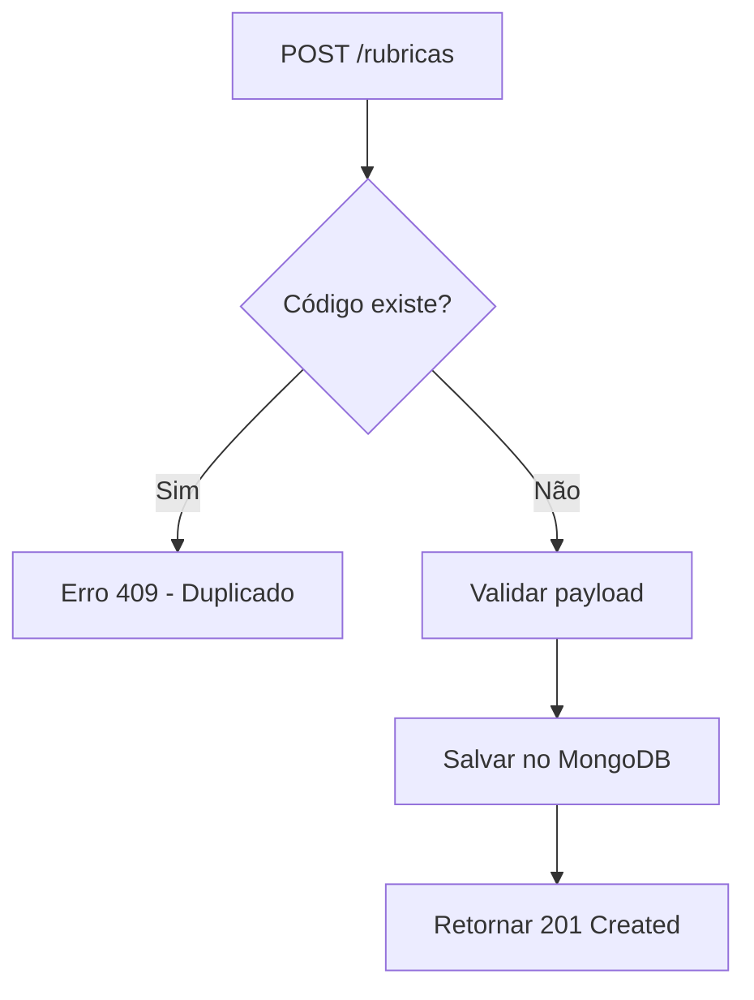

# API_1_RUBRICAS.md
## API 1 — CRUD de Rubricas (Documentação Completa e Extensivamente Detalhada)

--------------------------------------------------------------------------------
# 1. Visão Geral

A API de Rubricas é o **pilar fundamental** do sistema de extração e consolidação de contracheques CAIXA + FUNCEF.  
Ela fornece a tabela mestra de rubricas válidas, utilizadas em:

- Extração via regex
- Normalização de dados
- Validação dos lançamentos extraídos dos PDFs
- Consolidação de valores por rubrica/mês/ano
- Geração do Excel final
- Identificação de rubricas desconhecidas

Sem esta API implementada, **nenhum PDF pode ser corretamente processado**.

--------------------------------------------------------------------------------
# 2. Objetivos da API

1. Cadastrar rubricas válidas (24 iniciais).
2. Permitir consulta pública das rubricas ativas.
3. Permitir atualização de descrição/categoria.
4. Permitir desativação (soft delete).
5. Garantir unicidade do campo `codigo`.
6. Oferecer endpoints consistentes e seguros para serem utilizados pelo:
   - Extrator automático
   - Painel administrativo
   - Sistema de consolidação
   - Exportador de Excel

--------------------------------------------------------------------------------
# 3. Modelo de Dados (MongoDB)

A coleção `rubricas` possui o seguinte formato:

```json
{
  "codigo": "3362",
  "descricao": "REP. TAXA ADMINISTRATIVA - SALDADO",
  "categoria": "Administrativa",
  "ativo": true
}
```

### 3.1 Campos

| Campo | Tipo | Obrigatório | Descrição |
|-------|-------|-------------|-----------|
| `codigo` | string | ✔ | Identificador único da rubrica (PK) |
| `descricao` | string | ✔ | Nome da rubrica exatamente como aparecerá no PDF |
| `categoria` | string | ✖ | Classificação opcional (ex.: Administrativa, Extraordinária) |
| `ativo` | boolean | ✔ | Indica se a rubrica está ativa no sistema (default: true) |

### 3.2 Regras Estruturais

- `codigo` **não pode se repetir**
- `descricao` deve ser consistente com a descrição do PDF
- O extrator utiliza `descricao` para validar correspondência parcial
- `ativo = false` impede a rubrica de ser considerada no extrator e no Excel

--------------------------------------------------------------------------------
# 4. Fluxograma Completo da API de Rubricas

### 4.1 Criação de nova rubrica



### 4.2 Consultar rubrica por código

```mermaid
flowchart TD
    A[GET /rubricas/{codigo}] --> B{Existe?}
    B -->|Não| X[Erro 404 - Not Found]
    B -->|Sim| C[Retornar objeto]
```

### 4.3 Atualização

```mermaid
flowchart TD
    A[PUT /rubricas/{codigo}] --> B{Existe?}
    B -->|Não| X[404]
    B -->|Sim| C[Validar campos]
    C --> D[Atualizar]
    D --> E[Retornar 200]
```

### 4.4 Soft delete

```mermaid
flowchart TD
    A[DELETE /rubricas/{codigo}] --> B{Existe?}
    B -->|Não| X[404]
    B -->|Sim| C[ativo = false]
    C --> D[Salvar]
    D --> E[200 OK]
```

--------------------------------------------------------------------------------
# 5. Endpoints Completo (com exemplos extremos)

## 5.1 Criar Rubrica
```
POST /api/v1/rubricas
```

### Request Body (JSON)
```json
{
  "codigo": "3362",
  "descricao": "REP. TAXA ADMINISTRATIVA - SALDADO",
  "categoria": "Administrativa"
}
```

### Response 201
```json
{
  "codigo": "3362",
  "descricao": "REP. TAXA ADMINISTRATIVA - SALDADO",
  "categoria": "Administrativa",
  "ativo": true
}
```

### Possíveis erros:

| Código | Motivo |
|--------|---------|
| 400 | Payload mal formatado |
| 409 | Código já cadastrado |
| 422 | Descrição inválida |

---

## 5.2 Listar Rubricas
```
GET /api/v1/rubricas
```

### Response
```json
[
  {
    "codigo": "3362",
    "descricao": "REP. TAXA ADMINISTRATIVA - SALDADO",
    "categoria": "Administrativa",
    "ativo": true
  }
]
```

---

## 5.3 Consultar Rubrica por Código
```
GET /api/v1/rubricas/{codigo}
```

---

## 5.4 Atualizar Rubrica
```
PUT /api/v1/rubricas/{codigo}
```

### Request
```json
{
  "descricao": "REP. TAXA ADMINISTRATIVA SALDADO",
  "categoria": "Administrativa"
}
```

---

## 5.5 Desativar Rubrica
```
DELETE /api/v1/rubricas/{codigo}
```

Define:

```json
{
  "ativo": false
}
```

--------------------------------------------------------------------------------
# 6. Lista Completa das 24 Rubricas (JSON Importável)

```json
[
  {"codigo": "3362", "descricao": "REP. TAXA ADMINISTRATIVA - SALDADO"},
  {"codigo": "3394", "descricao": "REP TAXA ADMINISTRATIVA BUA"},
  {"codigo": "3396", "descricao": "REP TAXA ADMINISTRATIVA BUA NOVO PLANO"},
  {"codigo": "3430", "descricao": "REP CONTRIBUIÇÃO EXTRAORDINÁRIA 2014"},
  {"codigo": "3477", "descricao": "REP CONTRIBUIÇÃO EXTRAORDINÁRIA 2015"},
  {"codigo": "3513", "descricao": "REP CONTRIBUIÇÃO EXTRAORDINÁRIA 2016"},
  {"codigo": "3961", "descricao": "REP. TAXA ADMINISTRATIVA - NP"},
  {"codigo": "4236", "descricao": "FUNCEF NOVO PLANO"},
  {"codigo": "4362", "descricao": "TAXA ADMINISTRATIVA SALDADO"},
  {"codigo": "4364", "descricao": "TAXA ADMINISTRATIVA SALDADO 13º SAL"},
  {"codigo": "4369", "descricao": "FUNCEF NOVO PLANO GRAT NATAL"},
  {"codigo": "4412", "descricao": "FUNCEF CONTRIB EQU SALDADO 01"},
  {"codigo": "4416", "descricao": "FUNCEF CONTRIB EQU SALDADO 01 GRT NATAL"},
  {"codigo": "4430", "descricao": "CONTRIBUIÇÃO EXTRAORDINÁRIA 2014"},
  {"codigo": "4432", "descricao": "FUNCEF CONTRIB EQU SALDADO 02"},
  {"codigo": "4436", "descricao": "FUNCEF CONTRIB EQU SALDADO 02 GRT NATAL"},
  {"codigo": "4443", "descricao": "FUNCEF CONTRIB EQU SALDADO 03"},
  {"codigo": "4444", "descricao": "FUNCEF CONTRIB EQU SALDADO 03 GRT NATAL"},
  {"codigo": "4459", "descricao": "CONTRIBUIÇÃO EXTRAORDINÁRIA ABONO ANUAL 2014"},
  {"codigo": "4477", "descricao": "CONTRIBUIÇÃO EXTRAORDINÁRIA 2015"},
  {"codigo": "4482", "descricao": "CONTRIBUIÇÃO EXTRAORDINÁRIA ABONO ANUAL 2015"},
  {"codigo": "4513", "descricao": "CONTRIBUIÇÃO EXTRAORDINÁRIA 2016"},
  {"codigo": "4514", "descricao": "CONTRIBUIÇÃO EXTRAORDINÁRIA ABONO ANUAL 2016"},
  {"codigo": "4961", "descricao": "TAXA ADMINISTRATIVA NOVO PLANO"}
]
```

--------------------------------------------------------------------------------
# 7. Função do Extrator em Relação às Rubricas

O extrator utiliza rubricas desta forma:

### 7.1 Exemplo de linha do PDF
```
4482 CONTRIBUIÇÃO EXTRAORDINÁRIA 2015   2017/08   R$ 885,47
```

### 7.2 Passos do extrator

1. Detecta o **código da rubrica**:  
   ```
   4482
   ```

2. Verifica no MongoDB:
   ```
   db.rubricas.findOne({ codigo: "4482", ativo: true })
   ```

3. Caso não exista → entrada é ignorada e registrada em log.

4. Caso exista:

   - Confirma descrição compatível (via `contains` ou similar)
   - Extrai data
   - Extrai valor
   - Adiciona origem (CAIXA/FUNCEF)
   - Adiciona número da página

5. Gera objeto payroll_entry completo.

--------------------------------------------------------------------------------
# 8. Regras de Negócio para Implementação

- `codigo` deve ser sempre tratado como string.
- O sistema deve permitir cadastrar categorias opcionalmente.
- O PDF só deve aceitar rubricas que existam nesta tabela.
- Não pode excluir rubricas — apenas desativar.
- O Excel deve exibir rubricas somente na ordem estabelecida pela configuração administrativa.

--------------------------------------------------------------------------------
# 9. Recomendações Técnicas para Implementação

- Criar índice único em `codigo`.
- Criar service com validações robustas.
- Implementar testes automáticos:
  - criação duplicada
  - atualização correta
  - soft delete
- Criar seeds iniciais com CommandLineRunner.
- Permitir importação via JSON no futuro.

--------------------------------------------------------------------------------
# 10. Exemplos de Casos de Erro

### Código duplicado
```json
{
  "status": 409,
  "error": "Rubrica já cadastrada"
}
```

### Rubrica não encontrada
```json
{
  "status": 404,
  "error": "Rubrica não encontrada"
}
```

--------------------------------------------------------------------------------
# 11. Conclusão

Esta API precisa ser implementada **antes de qualquer outra**, pois o processamento de PDF depende totalmente da tabela de rubricas.

Após concluí-la, a próxima etapa da documentação será:
**MODELAGEM_MONGO.md (Arquivo #2)**

--------------------------------------------------------------------------------
