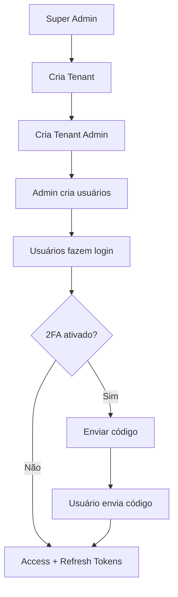

# API_9_MULTI_TENANT_AUTH.md  
# Autenticação Multi‑Tenant — JWT + Refresh Token + 2FA + Super Admin  
**Modelo A — Login apenas por e‑mail (email globalmente único)**  
**Arquitetura completa, detalhada e pronta para implementação (Clean Architecture + DDD + WebFlux)**  

---

# 🚀 1. OBJETIVO

Fornecer um sistema de autenticação **corporativo, escalável e seguro**, suportando:

- **Multi‑tenant real**, com isolamento total por empresa  
- **Super Admin global**  
- **Admins e usuários por empresa (tenant)**  
- **JWT Access Token + Refresh Token rotativo**  
- **2FA opcional (global, per‑tenant, per‑usuário)**  
- **Controle completo de segurança (lockout, brute‑force, auditoria)**  
- **Compatível com WebFlux (reativo)**  
- **MongoDB (Reactive Repository)**  
- **Em conformidade com SOLID + DDD + Clean Architecture**

---

# 🏢 2. MODELO MULTI‑TENANT ADOTADO (Modelo A — e‑mail único global)

O usuário faz login SOMENTE com:

```
email + senha
```

O email é **único globalmente**, garantindo:

- Sem ambiguidade entre empresas  
- UX mais simples  
- Token JWT já contém o tenant automaticamente  

Cada usuário pertence a **exatamente 1 tenant**, exceto o **super admin**.

---

# 🗂️ 3. ENTIDADES DO SISTEMA (MongoDB)

---

## 3.1. Tabela: tenants

Identifica cada empresa cliente do sistema.

```json
{
  "id": "tenant123",
  "nome": "Empresa XPTO",
  "dominioOpcional": "empresa.com",
  "ativo": true,
  "createdAt": "2024-03-10T10:00:00Z"
}
```

---

## 3.2. Tabela: users (atualizada)

```json
{
  "id": "user123",

  "tenantId": "tenant123", // super admin tem null

  "nome": "João Silva",
  "email": "admin@empresa.com",
  "senhaHash": "argon2id-hash",
  "roles": ["TENANT_ADMIN"],

  "twoFactorEnabled": true,
  "twoFactorTempCode": "123456",
  "twoFactorTempCodeExpires": "2024-03-10T12:30:00Z",
  "twoFactorForce": false,

  "refreshTokens": [
    {
      "token": "uuid-token",
      "createdAt": "2024-03-10T11:20:00Z",
      "expiresAt": "2024-04-10T11:20:00Z"
    }
  ],

  "ativo": true,
  "createdAt": "2024-03-10T09:00:00Z"
}
```

---

## 3.3. Todas as coleções passam a ter `tenantId`

Exemplo: payroll_documents

```json
{
  "id": "doc123",
  "tenantId": "tenant123",
  "cpf": "13050500055",
  "tipo": "CAIXA",
  "status": "PENDING"
}
```

---

# 🔐 4. ROLES E PERMISSÕES

| Papel          | Escopo                   | Permissões |
|----------------|---------------------------|------------|
| SUPER_ADMIN    | Global                    | Gerencia tenants e admins |
| TENANT_ADMIN   | Dentro do tenant          | Cria usuários, gerencia documentos |
| TENANT_USER    | Dentro do tenant          | Acesso limitado |

---

# 🔑 5. JWT COMPLETO (Access Token)

```json
{
  "sub": "user123",
  "tenantId": "tenant123",
  "email": "admin@empresa.com",
  "roles": ["TENANT_ADMIN"],
  "iat": 1710090000,
  "exp": 1710090900,
  "jti": "uuid"
}
```

### JWT Super Admin

```json
{
  "sub": "root",
  "roles": ["SUPER_ADMIN"],
  "iat": 1710090000,
  "exp": 1710090900
}
```

---

# 🧩 6. ENDPOINTS COMPLETOS

---

## 6.1. Criar Tenant (somente SUPER_ADMIN)

**POST /api/v1/tenants**

```json
{
  "nome": "Empresa XPTO"
}
```

Resposta:

```json
{
  "tenantId": "tenant123",
  "nome": "Empresa XPTO"
}
```

---

## 6.2. Criar Admin da Empresa

**POST /api/v1/tenants/{tenantId}/users/admin**

```json
{
  "nome": "João Silva",
  "email": "admin@empresa.com",
  "senha": "Senha123"
}
```

---

## 6.3. Criar Usuário da Empresa (Tenant Admin → Tenant User)

**POST /api/v1/users**

```json
{
  "nome": "Maria",
  "email": "maria@empresa.com",
  "senha": "12345",
  "roles": ["TENANT_USER"]
}
```

---

## 6.4. Login

**POST /api/v1/auth/login**

```json
{
  "email": "maria@empresa.com",
  "senha": "12345"
}
```

### Resposta sem 2FA

```json
{
  "accessToken": "...",
  "refreshToken": "..."
}
```

### Resposta com 2FA

```json
{
  "requires2FA": true,
  "message": "Código enviado por e-mail"
}
```

---

## 6.5. Verificação do código 2FA

**POST /api/v1/auth/verify-2fa**

```json
{
  "email": "maria@empresa.com",
  "code": "394812"
}
```

Resposta:

```json
{
  "accessToken": "...",
  "refreshToken": "..."
}
```

---

## 6.6. Refresh Token

**POST /api/v1/auth/refresh**

```json
{
  "refreshToken": "..."
}
```

---

## 6.7. Logout

**POST /api/v1/auth/logout**

---

# 🧠 7. FLUXOS MULTI‑TENANT (MERMAID)



---

# 🧱 8. REGRAS MULTI‑TENANT INTERNAS

---

## 8.1. Filtro WebFlux injeta `TenantContext`

Regras:

1. Super Admin → ignora tenant  
2. Admin/User → tenant obrigatório  
3. TODAS as queries Mongo adicionam tenantId automaticamente  

```java
filter = documentRepository.findByTenantId(TenantContext.id)
```

---

## 8.2. E-mail é globalmente único

Benefit:
- Não há ambiguidade de login  
- JWT tem tenantId automaticamente  

---

## 8.3. 2FA Hierárquico

2FA pode ser ativado:

- globalmente (`force2faGlobal`)
- por tenant (`tenant.force2fa`)
- por usuário (`user.twoFactorEnabled`)

Regra final:

```
2FA = force2faGlobal OR tenant.force2fa OR user.twoFactorEnabled
```

---

# 🔐 9. SEGURANÇA AVANÇADA

✔ Hash de senha Argon2id  
✔ Refresh token rotativo  
✔ Auditoria de tentativas  
✔ Lockout após 5 falhas  
✔ Tempo mínimo entre códigos 2FA  
✔ TTL automático em códigos 2FA  
✔ Expiração de refresh de 30 dias  
✔ Expiração de access de 15 minutos  
✔ jti único por token (revogável)  

---

# 🧩 10. CLASSES NECESSÁRIAS

### Domain
- User  
- Tenant  
- RefreshToken  
- TwoFactorCode  

### Application
- RegisterAdminUseCase  
- RegisterUserUseCase  
- LoginUseCase  
- Verify2FAUseCase  
- RefreshUseCase  
- LogoutUseCase  

### Infrastructure
- JwtService  
- Argon2PasswordService  
- EmailService  
- TenantContextFilter  
- MongoUserRepository  

---

# 🔚 11. ORDEM DE IMPLEMENTAÇÃO

1. Implementar TenantRepository  
2. Criar Super Admin inicial  
3. Criar fluxo de criação de tenants  
4. Implementar UserRepository com tenantId  
5. Implementar JwtService  
6. Implementar PasswordService  
7. Criar AuthService  
8. Criar TenantContextFilter  
9. Criar controllers  
10. Testes unitários  
11. Testes WebFlux integrados  

---

**Fim do documento — API_9_MULTI_TENANT_AUTH.md (versão completa)**
