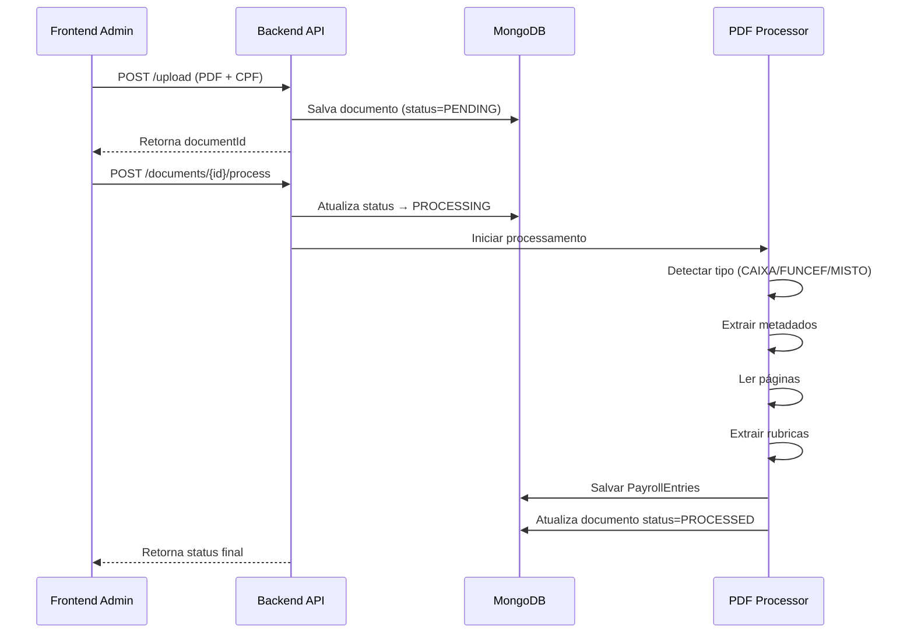
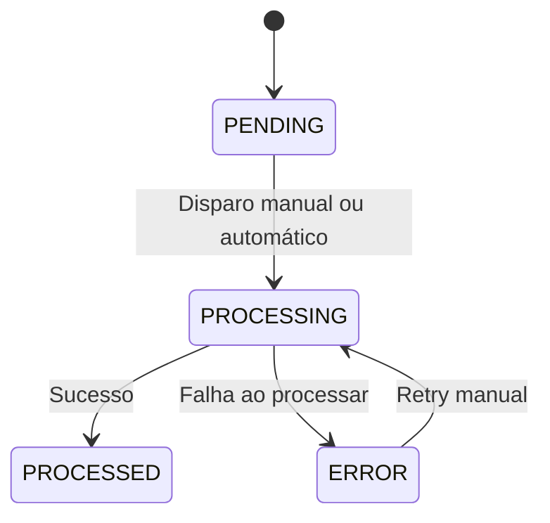
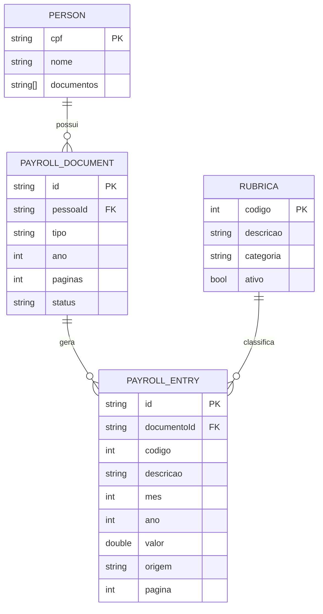

# DIAGRAMS.md — Diagramas do Sistema (CAIXA + FUNCEF Extractor)

Este documento reúne os principais diagramas do sistema:  
Fluxo de processamento, sequência, estados do documento, e fluxo completo do PDF até o Excel.

Todos os diagramas estão no padrão **Mermaid**, compatível com GitHub, GitLab e editores Markdown modernos.

---

# 🧭 1. Diagrama de Fluxo Geral do Sistema

```mermaid
flowchart LR
    U[Usuário / Admin] -->|Upload PDF| API[API REST]
    API --> DB[(MongoDB)]
    API --> PROC[Service de Processamento PDF]

    PROC --> DETECT[Detector de Tipo de Documento<br>(CAIXA/FUNCEF/MISTO)]
    DETECT --> META[Extrator de Metadados]
    META --> PARSE[Parser de Rubricas]
    PARSE --> ENTRIES[Criação de PayrollEntries]

    ENTRIES --> DB

    DB --> CONS[Consolidador de Dados]
    CONS --> EXCEL[Gerador Excel]

    API --> FE[Frontend Admin (React)]
```

---

# 🔄 2. Diagrama de Sequência — Upload e Processamento



---

# 🧬 3. Diagrama de Estados — Documento PDF



---

# 📦 4. Diagrama das Collections MongoDB



---

# 🧩 5. Diagrama do Processo de Extração (Pipeline Interno)

```mermaid
flowchart TD
    A[PDF Recebido] --> B[Detectar tipo<br>Caixa/Funcef/Misto]
    B --> C[Extrair metadados<br>Nome, CPF, Ano, Mes]
    C --> D[Ler páginas]
    D --> E[Determinar origem por página]
    E --> F[Extrair rubricas via Regex]
    F --> G[Normalizar valores<br>(decimal, datas)]
    G --> H[Salvar PayrollEntry no Mongo]
    H --> I[Finalizar status PROCESSED]
```

---

# 📥 6. Fluxo do Excel Consolidado

```mermaid
flowchart LR
    DB[(MongoDB)] --> AGGR[Agregação por Ano/Mês]
    AGGR --> MATRIX[Matriz consolidada<br>(rubricas x meses)]
    MATRIX --> TOTAL[Tabela de totais<br>(ano e geral)]
    TOTAL --> POI[Apache POI]
    POI --> FILE[Excel (.xlsx)]
    FILE --> USER[Download]
```

---

# ✔ Arquivo Completo Gerado

Este arquivo contém todos os diagramas essenciais para documentação técnica, revisões de arquitetura, onboarding e integração do time.

