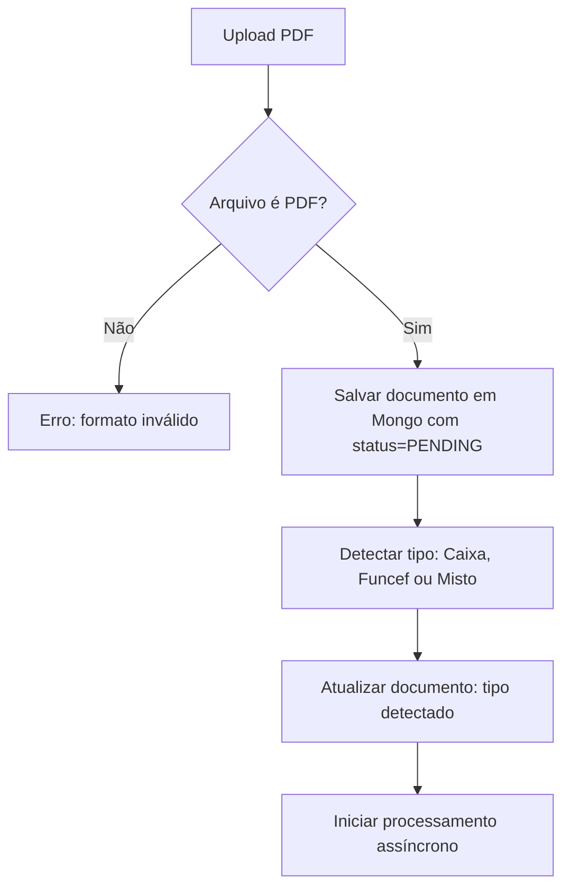
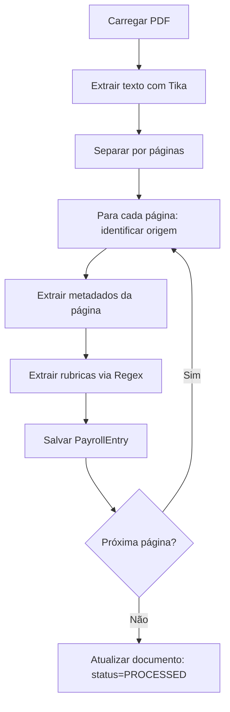

# Fluxogramas de Processamento

## 1. Upload e Identificação do Documento


## 2. Processamento de PDF


## 3. Consolidação por CPF
```mermaid
flowchart TD
    A[Requisição: /consolidated/{cpf}] --> B[Buscar pessoa]
    B --> C[Buscar todos documentos dela]
    C --> D[Buscar todas PayrollEntry]
    D --> E[Organizar por rubrica → mês → valor]
    E --> F[Montar matriz consolidada]
    F --> G[Retornar JSON consolidado]
```
