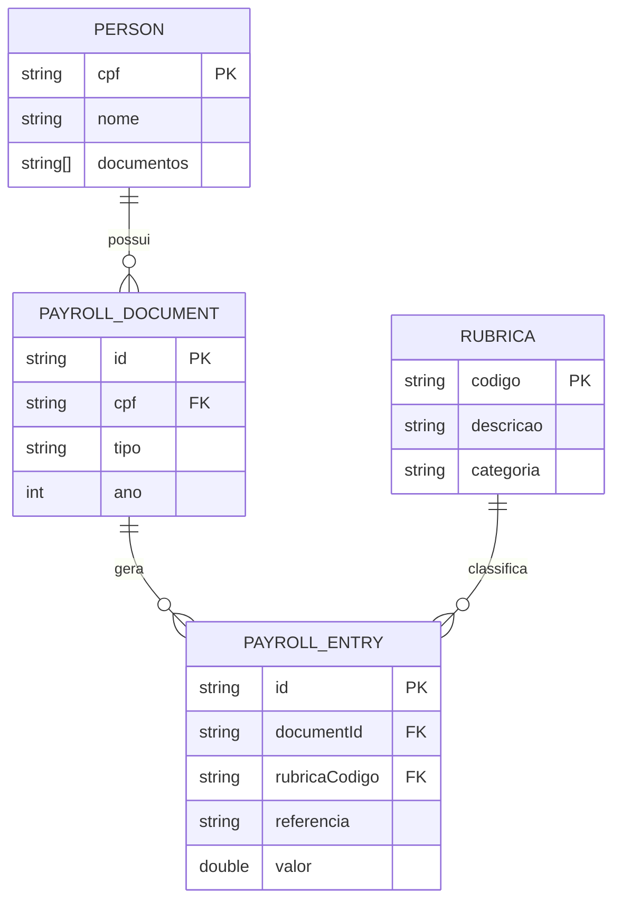
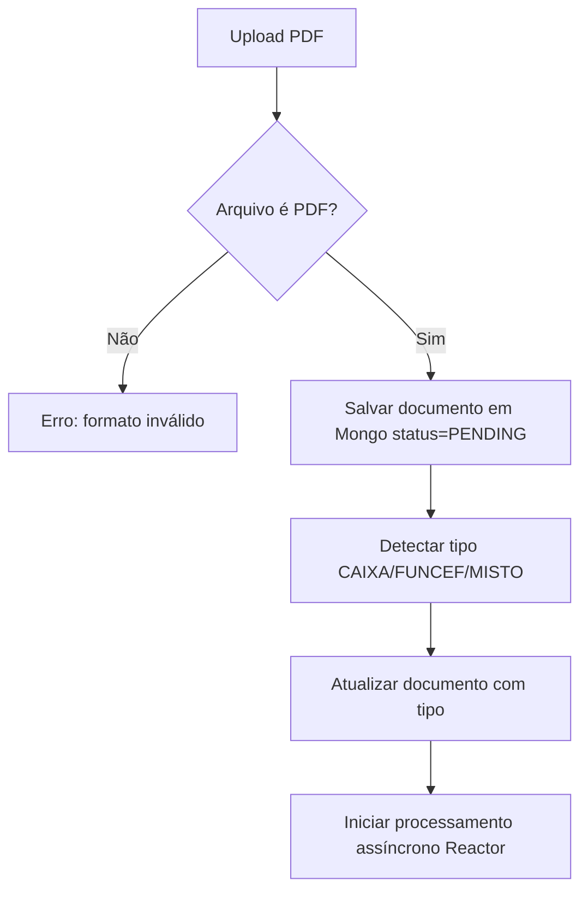

# MASTER_DOCUMENTATION.md  
## Sistema de Extração e Consolidação de Contracheques (CAIXA + FUNCEF)

--------------------------------------------------------------------------------
# 1. VISÃO GERAL DO SISTEMA
O sistema tem como objetivo processar arquivos PDF de contracheques da CAIXA e FUNCEF, extrair informações estruturadas de rubricas, gerar matriz consolidada por ano/mês, armazenar no MongoDB e disponibilizar tudo via API.

Fluxo geral:
- Upload PDF → Identificação (Caixa/Funcef/Misto)
- Extração de metadados (nome, CPF, datas, infos do documento)
- Extração de rubricas por regex
- Normalização de valores/datas
- Salvamento das entradas no MongoDB
- Consolidação por pessoa
- Geração de Excel final

--------------------------------------------------------------------------------
# 2. ARQUITETURA DO SISTEMA
Tecnologias:
- Spring Boot 3.x (Java 21 + suporte opcional a Kotlin)
- WebFlux (reativo)
- MongoDB (reativo)
- Apache PDFBox + Tika
- Reactor
- SpringDoc OpenAPI
- Apache POI (Excel)

Camadas:
- controller
- service
- processor (PDF engine)
- repository
- domain model
- util

--------------------------------------------------------------------------------
# 3. MODELO DE DADOS (MONGODB)

## 3.1 persons
Representa um titular dos contracheques.

```
{
  "cpf": "12449709568",
  "nome": "FLAVIO JOSE PEREIRA ALMEIDA",
  "documentos": ["doc123", "doc456"]
}
```

## 3.2 payroll_documents
Documento enviado e processado.

```
{
  "id": "doc123",
  "cpf": "12449709568",
  "tipo": "CAIXA | FUNCEF | MISTO",
  "ano": 2018,
  "status": "PENDING | PROCESSING | PROCESSED | ERROR",
  "detectedPages": [
    { "page": 1, "origem": "CAIXA" }
  ]
}
```

## 3.3 payroll_entries

```
{
  "documentId": "doc123",
  "rubricaCodigo": "4482",
  "rubricaDescricao": "CONTRIBUIÇÃO EXTRAORDINÁRIA ABONO ANUAL 2015",
  "referencia": "2017-08",
  "valor": 885.47,
  "pagina": 1,
  "origem": "CAIXA"
}
```

## 3.4 rubricas
Lista parametrizada de rubricas válidas (24 rubricas).

--------------------------------------------------------------------------------
# 4. DIAGRAMAS

## 4.1 ERD (Mermaid)


## 4.2 Fluxograma


--------------------------------------------------------------------------------
# 5. REGRAS DE PROCESSAMENTO

## 5.1 Identificação
- Contém "CONTRACHEQUE" + "CAIXA" → CAIXA  
- Contém "PREVIDENCIÁRIOS" → FUNCEF  
- Contém ambos → MISTO  

## 5.2 Origem por página
Regex analisa cabeçalho individualmente.

## 5.3 Extração de rubricas
Regex para CAIXA:
```
^([0-9]{3,4})\s+(.+?)\s+([0-9]{4}/[0-9]{2}|[0-9]{2}/[0-9]{4})\s+R\$?\s*([0-9\.\,]+)
```

Regex para FUNCEF varia, mas segue o mesmo padrão.

## 5.4 Normalização
- 1.399,59 → 1399.59
- 01/2017 → 2017-01
- 2017/01 → 2017-01

--------------------------------------------------------------------------------
# 6. API COMPLETA (UNIFICADA)

## POST /api/v1/documents/upload
Multipart:
- file  
- cpf  

Response:
```
{
  "documentId": "65f123abc",
  "status": "PENDING"
}
```

## POST /api/v1/documents/{id}/process
Reprocessa manualmente.

## GET /api/v1/persons/{cpf}/documents
Lista todos os documentos do CPF.

## GET /api/v1/documents/{id}/entries
Retorna rubricas extraídas.

## GET /api/v1/persons/{cpf}/consolidated
Retorna matriz consolidada.

## GET /api/v1/persons/{cpf}/excel
Download Excel.

## GET /api/v1/rubricas
Lista rubricas.

--------------------------------------------------------------------------------
# 7. BACKLOG (CONSOLIDADO)

## Épico 1 — Infraestrutura Backend
- Configurar projeto, WebFlux, Mongo, Actuator  
- Criar collections  
- Criar upload  

## Épico 2 — Extração PDF
- Extratores Caixa e Funcef  
- Regex  
- Normalização  

## Épico 3 — Processamento
- Pipeline reativo  
- Status  
- Manipulação multipáginas  

## Épico 4 — APIs
- upload  
- process  
- consolidated  
- entries  
- excel  

## Épico 5 — Consolidação
- matriz anual  
- totais  
- integração rubricas  

--------------------------------------------------------------------------------
# 8. SPRINT PLAN (4 Sprints)

### Sprint 1
- Estrutura inicial  
- collections  
- upload PDF  
- rubricas seed  

### Sprint 2
- extrator caixa  
- extrator funcef  
- normalização  
- entries  

### Sprint 3
- consolidação  
- excel  

### Sprint 4
- APIs adicionais  
- refinamentos  

--------------------------------------------------------------------------------
# 9. DATA DICTIONARY
Inclui todos os campos dos modelos persons, payroll_documents, payroll_entries, rubricas.

--------------------------------------------------------------------------------
# 10. ORDEM DE IMPLEMENTAÇÃO
1) upload  
2) detector de tipo  
3) extratores  
4) regex  
5) entries  
6) consolidated  
7) excel  
8) dashboard  

--------------------------------------------------------------------------------
Fim da documentação master.