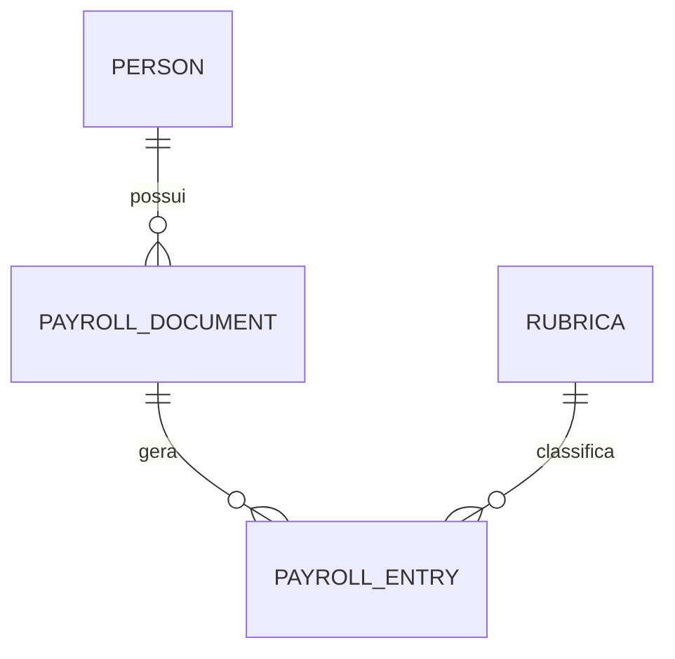

# MODELAGEM_MONGO.md
# 📦 Modelagem de Dados — MongoDB  
Sistema de Extração e Consolidação de Contracheques (CAIXA + FUNCEF)

Este documento unifica **toda a modelagem oficial do MongoDB**, incluindo:

- Definição das collections  
- Esquemas detalhados  
- Dicionário de dados  
- Regras de relacionamento  
- Índices recomendados  
- Modelos exemplos completos  
- Observações para implementação  
- Regras de validação  
- Estrutura esperada para APIs 1 a 7  

É o documento que servirá de referência para o **backend**, **extrator** e **front-end administrativo**.

---

# ✔ LISTA DE COLLECTIONS

1. **persons**
2. **payroll_documents**
3. **payroll_entries**
4. **rubricas**
5. **logs_extracao** (opcional, recomendado)
6. **fs.files / fs.chunks** (GridFS - armazenamento de PDFs)

---

# 📁 1. COLLECTION: persons  
Representa uma pessoa (titular) que possui contracheques.

## 📌 Estrutura Completa
```json
{
  "cpf": "12449709568",
  "nome": "FLAVIO JOSE PEREIRA ALMEIDA",
  "documentos": ["65f123abc", "65f555abc"],
  "createdAt": "2024-01-10T14:00:00Z",
  "updatedAt": "2024-01-12T09:45:00Z"
}
```

## 🔎 Dicionário de Dados
| Campo | Tipo | Obrigatório | Descrição |
|-------|------|-------------|-----------|
| cpf | string | ✔ | Identificador único |
| nome | string | ✔ | Nome completo |
| documentos | array[string] | ❌ | IDs dos documentos enviados |
| createdAt | date | ✔ | Data de criação |
| updatedAt | date | ✔ | Data de alteração |

## 🔐 Índices Recomendados
- `cpf` (unique)
- `documentos`

---

# 📁 2. COLLECTION: payroll_documents  
Representa um arquivo PDF enviado e processado.

## 📌 Estrutura Completa
```json
{
  "id": "65f123abc",
  "cpf": "12449709568",
  "tipo": "CAIXA",
  "status": "PROCESSING",
  "anoDetectado": 2018,
  "mesesDetectados": ["2018-01", "2018-02"],
  "detectedPages": [
    { "page": 1, "origem": "CAIXA" },
    { "page": 2, "origem": "CAIXA" }
  ],
  "originalFileId": "676ba912f9c12234b9d826aa",
  "dataUpload": "2024-01-10T14:32:00Z",
  "dataProcessamento": "2024-01-10T15:00:00Z",
  "erro": null
}
```

## 🔎 Dicionário de Dados
| Campo | Tipo | Obrigatório | Descrição |
|--------|------|------------|-----------|
| id | string | ✔ | ID do documento |
| cpf | string | ✔ | CPF associado |
| tipo | enum | ❌ | CAIXA, FUNCEF, MISTO |
| status | string | ✔ | PENDING/PROCESSING/PROCESSED/ERROR |
| anoDetectado | int | ❌ | Ano do contracheque |
| mesesDetectados | array[string] | ❌ | Meses encontrados |
| detectedPages | array[obj] | ❌ | Origem por página |
| originalFileId | ObjectId | ✔ | ID no GridFS |
| erro | string | ❌ | Mensagem de erro |

## 🔐 Índices Recomendados
- `cpf`
- `status`
- `dataUpload`
- `tipo`

---

# 📁 3. COLLECTION: payroll_entries  
Representa cada linha extraída do contracheque.

## 📌 Estrutura Completa
```json
{
  "id": "entry123",
  "documentId": "65f123abc",
  "cpf": "12449709568",
  "rubricaCodigo": "4482",
  "rubricaDescricao": "CONTRIBUIÇÃO EXTRAORDINÁRIA ABONO ANUAL 2015",
  "referencia": "2017-08",
  "mes": 8,
  "ano": 2017,
  "valor": 885.47,
  "pagina": 1,
  "origem": "CAIXA",
  "rawText": "4482 CONTRIBUIÇÃO EXTRAORDINÁRIA 2015 2017/08 R$ 885,47"
}
```

## 🔎 Dicionário de Dados
| Campo | Tipo | Obrigatório | Descrição |
|--------|------|-------------|-----------|
| id | string | ✔ | ID da linha |
| documentId | string | ✔ | FK para payroll_documents |
| cpf | string | ✔ | FK para persons |
| rubricaCodigo | string | ✔ | Código detectado |
| rubricaDescricao | string | ✔ | Descrição confirmada |
| referencia | string | ✔ | YYYY-MM |
| mes | int | ✔ | 1–12 |
| ano | int | ✔ | Ano |
| valor | number | ✔ | Valor numérico |
| origem | string | ✔ | CAIXA/FUNCEF |
| pagina | int | ✔ | Página |
| rawText | string | ❌ | Texto original |

## 🔐 Índices Recomendados
- `cpf`
- `documentId`
- `rubricaCodigo`
- `referencia`

---

# 📁 4. COLLECTION: rubricas  
Lista fixa de rubricas esperadas.

## 📌 Estrutura Completa
```json
{
  "codigo": "4482",
  "descricao": "CONTRIBUIÇÃO EXTRAORDINÁRIA ABONO ANUAL 2015",
  "categoria": "Extraordinária",
  "ativo": true,
  "createdAt": "2024-01-10T14:32:00Z"
}
```

## 🔎 Dicionário de Dados
| Campo | Tipo | Obrigatório | Descrição |
|--------|--------|-----------|-----------|
| codigo | string | ✔ | Código único |
| descricao | string | ✔ | Descrição |
| categoria | string | ❌ | Administrativa / Extraordinária |
| ativo | boolean | ✔ | Default: true |

## 📌 JSON Oficial das 24 Rubricas
(Completo)

```json
[
  {"codigo": "3362", "descricao": "REP. TAXA ADMINISTRATIVA - SALDADO"},
  {"codigo": "3394", "descricao": "REP TAXA ADMINISTRATIVA BUA"},
  {"codigo": "3396", "descricao": "REP TAXA ADMINISTRATIVA BUA NOVO PLANO"},
  {"codigo": "3430", "descricao": "REP CONTRIBUIÇÃO EXTRAORDINÁRIA 2014"},
  {"codigo": "3477", "descricao": "REP CONTRIBUIÇÃO EXTRAORDINÁRIA 2015"},
  {"codigo": "3513", "descricao": "REP CONTRIBUIÇÃO EXTRAORDINÁRIA 2016"},
  {"codigo": "3961", "descricao": "REP. TAXA ADMINISTRATIVA - NP"},
  {"codigo": "4236", "descricao": "FUNCEF NOVO PLANO"},
  {"codigo": "4362", "descricao": "TAXA ADMINISTRATIVA SALDADO"},
  {"codigo": "4364", "descricao": "TAXA ADMINISTRATIVA SALDADO 13º SAL"},
  {"codigo": "4369", "descricao": "FUNCEF NOVO PLANO GRAT NATAL"},
  {"codigo": "4412", "descricao": "FUNCEF CONTRIB EQU SALDADO 01"},
  {"codigo": "4416", "descricao": "FUNCEF CONTRIB EQU SALDADO 01 GRT NATAL"},
  {"codigo": "4430", "descricao": "CONTRIBUIÇÃO EXTRAORDINÁRIA 2014"},
  {"codigo": "4432", "descricao": "FUNCEF CONTRIB EQU SALDADO 02"},
  {"codigo": "4436", "descricao": "FUNCEF CONTRIB EQU SALDADO 02 GRT NATAL"},
  {"codigo": "4443", "descricao": "FUNCEF CONTRIB EQU SALDADO 03"},
  {"codigo": "4444", "descricao": "FUNCEF CONTRIB EQU SALDADO 03 GRT NATAL"},
  {"codigo": "4459", "descricao": "CONTRIBUIÇÃO EXTRAORDINÁRIA ABONO ANUAL 2014"},
  {"codigo": "4477", "descricao": "CONTRIBUIÇÃO EXTRAORDINÁRIA 2015"},
  {"codigo": "4482", "descricao": "CONTRIBUIÇÃO EXTRAORDINÁRIA ABONO ANUAL 2015"},
  {"codigo": "4513", "descricao": "CONTRIBUIÇÃO EXTRAORDINÁRIA 2016"},
  {"codigo": "4514", "descricao": "CONTRIBUIÇÃO EXTRAORDINÁRIA ABONO ANUAL 2016"},
  {"codigo": "4961", "descricao": "TAXA ADMINISTRATIVA NOVO PLANO"}
]
```

---

# 📁 5. COLLECTION: logs_extracao (opcional, mas recomendado)

## Estrutura
```json
{
  "id": "log123",
  "documentId": "65f123abc",
  "pagina": 1,
  "tipo": "RUBRICA_NAO_RECONHECIDA",
  "mensagem": "Rubrica '9999 TAXA XYZ' não encontrada",
  "rawText": "9999 TAXA XYZ 2017/03 823,00",
  "timestamp": "2024-01-10T15:35:00Z"
}
```

Útil para auditoria e debugging.

---

# 🔗 RELACIONAMENTOS ENTRE COLLECTIONS

| Origem | Relação | Destino |
|--------|---------|----------|
| persons | 1:N | payroll_documents |
| payroll_documents | 1:N | payroll_entries |
| rubricas | 1:N | payroll_entries |

Mermaid:



---

# 🧠 REGRAS DE CONSISTÊNCIA

### 1. persons → payroll_documents
- Documento só pode existir se CPF estiver cadastrado.
- Se não existir, deve ser criado automaticamente.

### 2. payroll_documents → payroll_entries
- Apenas documentos `PROCESSED` podem gerar entries.

### 3. payroll_entries → rubricas
- Se rubrica não existir → entry **não deve ser criada**.

---

# 📊 ÍNDICES MONGODB RECOMENDADOS

### persons
```
{ cpf: 1 } UNIQUE
{ documentos: 1 }
```

### payroll_documents
```
{ cpf: 1 }
{ status: 1 }
{ tipo: 1 }
{ dataUpload: -1 }
```

### payroll_entries
```
{ cpf: 1 }
{ documentId: 1 }
{ referencia: 1 }
{ rubricaCodigo: 1 }
```

---

# 🔍 VALIDAÇÕES GERAIS

### CPF
- Mod11
- Formato apenas números

### PDF
- Deve conter texto extraível
- Deve ter cabeçalhos válidos

### Rubricas
- Código deve existir
- Ativo deve ser TRUE

---

# 🔚 CONCLUSÃO

Este documento consolida **toda a modelagem MongoDB** necessária para implementar:

- API 1 — Rubricas  
- API 2 — Upload  
- API 3 — Processamento  
- API 4 — Entries  
- API 5 — Consolidado  
- API 6 — Excel  
- API 7 — Consulta Documentos  

É a base estrutural para todo o sistema.

